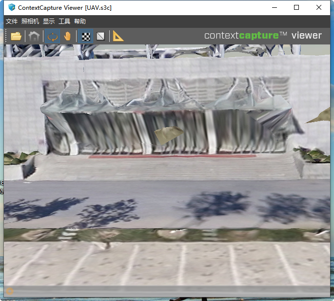

This project addressed a common challenge in 3D modeling where models generated solely from UAV (drone) data lack sufficient ground-level detail and texture clarity. My goal was to develop a cost-effective method to fuse aerial imagery with high-resolution, ground-based smartphone images to produce a single, high-fidelity 3D model of the Tianjin Normal University Library.

My methodology centered on unifying the two disparate datasets within a single coordinate system. I first created a detailed local model from the smartphone images, then used common tie points to perform an absolute orientation and similarity transformation on the UAV dataset. This precisely aligned the large-scale aerial model with the detailed ground model. By merging the two aligned datasets in ContextCapture, I was able to generate a final, integrated model.

The results were a significant success. The fused model exhibited crisp, clear textures and complete, accurate geometry for complex ground-level features like walkways and building entrances—details that were previously distorted or blurry. This project demonstrates a practical and scalable workflow for creating more realistic and accurate digital twins for urban planning and architectural visualization without relying on expensive, specialized equipment.

Drone modeling results:

<!-- {}
Create your slides in Markdown - click the *Slides* button to check out the example.
{} -->

<!-- Add the publication's **full text** or **supplementary notes** here. You can use rich formatting such as including [code, math, and images](https://docs.hugoblox.com/content/writing-markdown-latex/). -->
