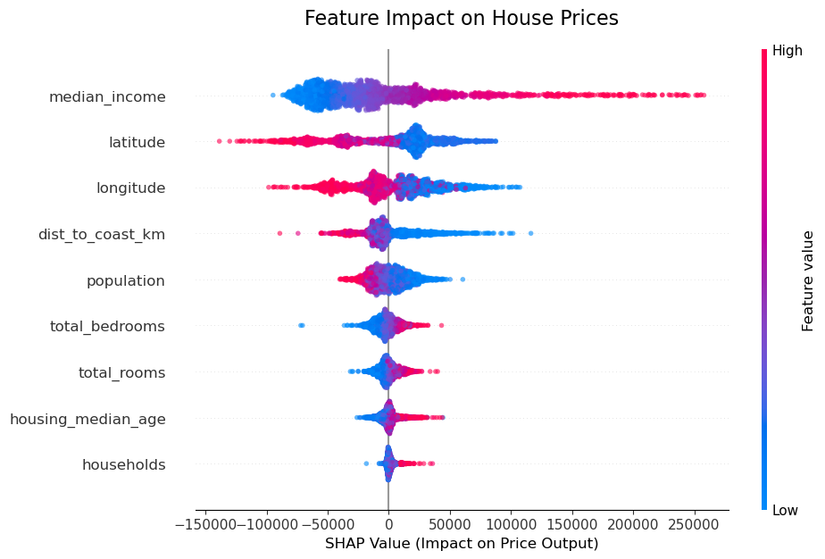

# California Housing Valuation: A Geo-XAI Approach
### Integrating GIS Feature Engineering with Explainable AI

#### 1. Project Overview
This project aims to build a robust valuation model for California real estate by fusing **Geospatial Analysis** with **Machine Learning**. Unlike traditional models that treat location merely as coordinates, this approach engineers spatial features (specifically proximity to the coastline) to capture the non-linear economic value of "location".

#### 2. Key Objectives
* **Quantify the "Location Premium":** Determine exactly how much value proximity to the ocean adds to a property.
* **Enhance Model Performance:** Utilise **XGBoost** to capture complex, non-linear relationships in housing data.
* **Ensure Explainability:** Deploy **SHAP (SHapley Additive exPlanations)** to deconstruct the "black box" model and visualise the marginal contribution of spatial features.

#### 3. Methodological Highlights
* **GIS Engineering:** Topology repair (`buffer(0)`) and metric projection (EPSG:3310) for accurate distance calculations.
* **Explainable AI:** Global and local interpretation using Game Theory concepts (Shapley values).

## 1 Data Acquisition and Setup

**Objective:**
To extract the raw California Housing dataset and initialise the analytical environment.

**Methodology:**
Utilised `pandas` for data manipulation. The dataset is sourced directly from the repository, ensuring reproducibility. This stage involves a preliminary inspection of the data structure to identify potential quality issues (e.g., missing values or data types).


```python
import pandas as pd
import numpy as np
import geopandas as gpd
import shap
import xgboost as xgb
import folium
from folium.plugins import HeatMap
import branca.colormap as cm
import matplotlib.pyplot as plt
from shapely.geometry import Point
from sklearn.model_selection import train_test_split

# --- Step 1: Load Dataset ---
# URL for the California Housing dataset
url = "https://raw.githubusercontent.com/ageron/handson-ml/master/datasets/housing/housing.csv"
print("Status: Downloading dataset...")
df = pd.read_csv(url)

print(f"Success: Dataset loaded with {len(df)} records.")
# Display first 5 rows
df.head()
```

    Status: Downloading dataset...
    Success: Dataset loaded with 20640 records.
    


<div>
<style scoped>
    .dataframe tbody tr th:only-of-type {
        vertical-align: middle;
    }

    .dataframe tbody tr th {
        vertical-align: top;
    }

    .dataframe thead th {
        text-align: right;
    }
</style>
<table border="1" class="dataframe">
  <thead>
    <tr style="text-align: right;">
      <th></th>
      <th>longitude</th>
      <th>latitude</th>
      <th>housing_median_age</th>
      <th>total_rooms</th>
      <th>total_bedrooms</th>
      <th>population</th>
      <th>households</th>
      <th>median_income</th>
      <th>median_house_value</th>
      <th>ocean_proximity</th>
    </tr>
  </thead>
  <tbody>
    <tr>
      <th>0</th>
      <td>-122.23</td>
      <td>37.88</td>
      <td>41.0</td>
      <td>880.0</td>
      <td>129.0</td>
      <td>322.0</td>
      <td>126.0</td>
      <td>8.3252</td>
      <td>452600.0</td>
      <td>NEAR BAY</td>
    </tr>
    <tr>
      <th>1</th>
      <td>-122.22</td>
      <td>37.86</td>
      <td>21.0</td>
      <td>7099.0</td>
      <td>1106.0</td>
      <td>2401.0</td>
      <td>1138.0</td>
      <td>8.3014</td>
      <td>358500.0</td>
      <td>NEAR BAY</td>
    </tr>
    <tr>
      <th>2</th>
      <td>-122.24</td>
      <td>37.85</td>
      <td>52.0</td>
      <td>1467.0</td>
      <td>190.0</td>
      <td>496.0</td>
      <td>177.0</td>
      <td>7.2574</td>
      <td>352100.0</td>
      <td>NEAR BAY</td>
    </tr>
    <tr>
      <th>3</th>
      <td>-122.25</td>
      <td>37.85</td>
      <td>52.0</td>
      <td>1274.0</td>
      <td>235.0</td>
      <td>558.0</td>
      <td>219.0</td>
      <td>5.6431</td>
      <td>341300.0</td>
      <td>NEAR BAY</td>
    </tr>
    <tr>
      <th>4</th>
      <td>-122.25</td>
      <td>37.85</td>
      <td>52.0</td>
      <td>1627.0</td>
      <td>280.0</td>
      <td>565.0</td>
      <td>259.0</td>
      <td>3.8462</td>
      <td>342200.0</td>
      <td>NEAR BAY</td>
    </tr>
  </tbody>
</table>
</div>


## 2 Geospatial Feature Engineering (GIS)

**The Problem:**
Raw GPS coordinates (Latitude/Longitude) are insufficient for Machine Learning models to intuitively understand "proximity". A model does not inherently know that a specific coordinate is "near the beach".

**The Solution:**
Engineered a new feature: **`dist_to_coast_km`**.

**Technical Implementation:**
1.  **Coordinate Transformation:** Converted the dataset from a global angular system (EPSG:4326, WGS84) to a local projected system (EPSG:3310, California Albers). This allows us to measure distances in **metres** rather than degrees, which is crucial for accuracy.
2.  **Topology Repair:** Real-world geospatial data often contains geometry errors (e.g., self-intersections). We applied a **`buffer(0)`** operation to mathematically repair the coastline polygon, ensuring robust spatial operations.
3.  **Spatial Join & Calculation:** We calculated the geodesic distance from every property to the nearest point on the California coastline.


```python
# GIS Feature Engineering
# Calculate the precise geodesic distance from each property to the nearest coastline.

# Convert DataFrame to GeoDataFrame
# Initial CRS: EPSG:4326 (WGS84 - Latitude/Longitude)
gdf = gpd.GeoDataFrame(
    df, geometry=gpd.points_from_xy(df.longitude, df.latitude), crs="EPSG:4326"
)

print("Fetching California coastline data...")
# Load California counties boundary from public GeoJSON
ca_url = "https://raw.githubusercontent.com/codeforgermany/click_that_hood/main/public/data/california-counties.geojson"
ca_counties = gpd.read_file(ca_url)

# Topology Repair
print("Repairing topology errors (Buffer 0 fix)...")
# Fix self-intersection or invalid geometries to prevent dissolve errors
ca_counties['geometry'] = ca_counties.geometry.buffer(0)

# Dissolve counties to get the outer boundary of California
print("Dissolving boundaries...")
ca_boundary = ca_counties.dissolve()

# Reproject to EPSG:3310 (California Albers) for accurate meter-based distance calculation
print("Reprojecting to EPSG:3310 (Meters)...")
gdf = gdf.to_crs("EPSG:3310")
ca_boundary = ca_boundary.to_crs("EPSG:3310")

# Extract the boundary line
coastline = ca_boundary.boundary

print("Calculating distance to coast")
# Calculate distance for every point
gdf['dist_to_coast'] = gdf.geometry.apply(lambda x: coastline.distance(x))

# Convert back to standard DataFrame for Machine Learning
df_ml = pd.DataFrame(gdf.drop(columns='geometry'))
# Convert meters to kilometers for better readability
df_ml['dist_to_coast_km'] = df_ml['dist_to_coast'] / 1000 

print("GIS Feature Engineering complete.")
print(df_ml[['longitude', 'latitude', 'median_house_value', 'dist_to_coast_km']].head())
```

    Fetching California coastline data...
    

    d:\python\envs\spatial_env\Lib\site-packages\geopandas\io\file.py:399: FutureWarning: errors='ignore' is deprecated and will raise in a future version. Use to_datetime without passing `errors` and catch exceptions explicitly instead
      as_dt = pd.to_datetime(df[k], errors="ignore")
    d:\python\envs\spatial_env\Lib\site-packages\geopandas\io\file.py:399: FutureWarning: errors='ignore' is deprecated and will raise in a future version. Use to_datetime without passing `errors` and catch exceptions explicitly instead
      as_dt = pd.to_datetime(df[k], errors="ignore")
    

    Repairing topology errors (Buffer 0 fix)...
    Dissolving boundaries...
    Reprojecting to EPSG:3310 (Meters)...
    Calculating distance to coast
    GIS Feature Engineering complete.
       longitude  latitude  median_house_value  dist_to_coast_km
    0    -122.23     37.88            452600.0          6.721602
    1    -122.22     37.86            358500.0          7.159210
    2    -122.24     37.85            352100.0          5.249944
    3    -122.25     37.85            341300.0          4.381984
    4    -122.25     37.85            342200.0          4.381984
    

## 3 Predictive Modelling with XGBoost

**Objective:**
To train a high-performance regression model capable of predicting median house values.

**Methodology:**
We employed **XGBoost (eXtreme Gradient Boosting)**.

**Why XGBoost?**
Real estate pricing is rarely linear. The relationship between income, location, and price is complex and multifaceted. Tree-based ensemble methods like XGBoost excel at capturing these **non-linear dependencies** and interactions between features (e.g., the interaction between high income and coastal location) better than traditional Linear Regression.


```python
# Data Preparation & Modeling 

# Feature Selection:
# Remove target variable, old categorical column, and the raw meter-distance column
X = df_ml.drop(columns=['median_house_value', 'ocean_proximity', 'dist_to_coast'])

# Handle missing values (Simple imputation with mean)
X = X.fillna(X.mean())

y = df_ml['median_house_value']

# Split data into Training and Testing sets (80/20 split)
X_train, X_test, y_train, y_test = train_test_split(X, y, test_size=0.2, random_state=42)

# Initialise and Train XGBoost Regressor
print("Training XGBoost Model...")
model = xgb.XGBRegressor(n_estimators=100, learning_rate=0.1, max_depth=6, random_state=42)
model.fit(X_train, y_train)

# Evaluate Model
score = model.score(X_test, y_test)
print(f"Success: Model R² Score: {score:.4f}")
```

    Training XGBoost Model...
    Success: Model R² Score: 0.8187
    

## 4 Model Explainability (XAI)

**The Problem:**
While XGBoost offers high accuracy, it is often criticised as a "black box"—it is difficult to understand *why* it makes a specific prediction. In a commercial setting, stakeholders need to trust the logic behind the valuation.

**The Solution:**
We utilised **SHAP (SHapley Additive exPlanations)** values.

**Significance:**
SHAP values originate from Game Theory. They mathematically allocate the credit (or blame) for a specific price prediction among the various features.
* **Global Interpretability:** The Summary Plot (below) shows us which features are the most important drivers of price across the entire state.
* **Directionality:** We can observe whether a feature (like `dist_to_coast_km`) is driving prices **up** (positive SHAP) or **down** (negative SHAP).


```python
# Model Explainability (SHAP Analysis)

print("Status: Calculating SHAP values...")

# Initialise TreeExplainer
explainer = shap.TreeExplainer(model)
shap_values = explainer.shap_values(X_test)

# Visualisation: Optimized Beeswarm Plot
# Downsampling to avoid overplotting and improve clarity
limit = 2000
if X_test.shape[0] > limit:
    indices = np.random.choice(X_test.shape[0], limit, replace=False)
    shap_subset = shap_values[indices]
    X_subset = X_test.iloc[indices]
else:
    shap_subset = shap_values
    X_subset = X_test

# Plotting
plt.figure(figsize=(12, 8))
shap.summary_plot(shap_subset, X_subset, 
                  max_display=10, 
                  alpha=0.6, 
                  plot_size=(10, 6),
                  show=False)

# Add Labels
plt.title("Feature Impact on House Prices", fontsize=16, pad=20)
plt.xlabel("SHAP Value (Impact on Price Output)", fontsize=12)
plt.yticks(fontsize=12)

print("Displaying SHAP Summary Plot:")
plt.show()
```

    Status: Calculating SHAP values...
    Displaying SHAP Summary Plot:
    


    

    


```python
plt.figure(figsize=(10, 6))

shap.summary_plot(shap_values, X_test, 
                  plot_type="bar", 
                  max_display=10, 
                  color='#007acc', 
                  show=False)

plt.title("Average Impact Magnitude of Features", fontsize=16, pad=20)
plt.xlabel("Average |SHAP Value| (Mean Impact on Price)", fontsize=12)
plt.show()
```


    

    


## 5 Interactive Visualisation of Location Premium

**Objective:**
To visualise the **spatial heterogeneity** of housing value drivers.

**The Solution:**
Generated an interactive HeatMap that visualises the **Location Premium**.

**How to Read this Map:**
Instead of mapping the *total house price*, we map the **SHAP Interaction Values** of the spatial features.
* **Red Areas:** Indicate a **positive location premium**. The geography itself adds significant value to the property (e.g., Coastal zones, Bay Area).
* **Blue Areas:** Indicate a **negative location impact**. The location detracts from the potential value compared to the state average (e.g., Inland deserts).

**Technical Note:**
To enable web-based rendering via `Folium`, we perform explicit type conversion (`float32` to `float`) to ensure JSON serialisation compatibility.


```python
# Interactive Geospatial Visualization
# Visualise the "Location Premium" (Pure spatial contribution to price)

print("Generating interactive map with legend...")

# 1. Sampling for performance
sample_size = 2000 
actual_size = min(sample_size, len(X_test))
indices = np.random.choice(X_test.index, size=actual_size, replace=False)

# 2. Extract Data
lat_idx = X_test.columns.get_loc('latitude')
lon_idx = X_test.columns.get_loc('longitude')
dist_idx = X_test.columns.get_loc('dist_to_coast_km')

subset_shap = shap_values[np.isin(X_test.index, indices)]

# Calculate Location Premium: Sum of Latitude, Longitude, and Distance-to-Coast effects
location_impact = subset_shap[:, lat_idx] + subset_shap[:, lon_idx] + subset_shap[:, dist_idx]

# Define range for the legend
min_val = np.min(location_impact)
max_val = np.max(location_impact)

# Prepare coordinates
lat_data = X_test.loc[indices, 'latitude'].values
lon_data = X_test.loc[indices, 'longitude'].values

# 3. Create Base Map
m = folium.Map(location=[36.7, -119.4], zoom_start=6, tiles='CartoDB dark_matter')

# 4. Add Color Legend (Red = High Premium, Blue = Negative Impact)
colormap = cm.LinearColormap(
    colors=['blue', 'cyan', 'lime', 'yellow', 'red'],
    vmin=min_val,
    vmax=max_val,
    caption='Location Premium (Net Impact on Price in USD)' 
)
m.add_child(colormap)

# 5. Prepare Data for HeatMap 
data_heat = []
for i in range(len(lat_data)):
    # Explicitly convert numpy types to standard python floats
    lat = float(lat_data[i])
    lon = float(lon_data[i])
    weight = float(location_impact[i])
    
    # Normalize weight to 0-1 range for the heatmap gradient
    normalized_weight = (weight - min_val) / (max_val - min_val)
    
    data_heat.append([lat, lon, normalized_weight])

# 6. Add HeatMap Layer
HeatMap(data_heat, radius=15, blur=20, 
        gradient={0.0: 'blue', 0.25: 'cyan', 0.5: 'lime', 0.75: 'yellow', 1.0: 'red'}).add_to(m)

print(f"Map generated. Value range: ${min_val:.0f} to ${max_val:.0f}")
m
```

    Generating interactive map with legend...
    Map generated. Value range: $-117689 to $205764
    


<div style="width:100%;"><div style="position:relative;width:100%;height:0;padding-bottom:60%;"><span style="color:#565656">Make this Notebook Trusted to load map: File -> Trust Notebook</span><iframe srcdoc="&lt;!DOCTYPE html&gt;
&lt;html&gt;
&lt;head&gt;

    &lt;meta http-equiv=&quot;content-type&quot; content=&quot;text/html; charset=UTF-8&quot; /&gt;

        &lt;script&gt;
            L_NO_TOUCH = false;
            L_DISABLE_3D = false;
        &lt;/script&gt;

    &lt;style&gt;html, body {width: 100%;height: 100%;margin: 0;padding: 0;}&lt;/style&gt;
    &lt;style&gt;#map {position:absolute;top:0;bottom:0;right:0;left:0;}&lt;/style&gt;
    &lt;script src=&quot;https://cdn.jsdelivr.net/npm/leaflet@1.9.3/dist/leaflet.js&quot;&gt;&lt;/script&gt;
    &lt;script src=&quot;https://code.jquery.com/jquery-3.7.1.min.js&quot;&gt;&lt;/script&gt;
    &lt;script src=&quot;https://cdn.jsdelivr.net/npm/bootstrap@5.2.2/dist/js/bootstrap.bundle.min.js&quot;&gt;&lt;/script&gt;
    &lt;script src=&quot;https://cdnjs.cloudflare.com/ajax/libs/Leaflet.awesome-markers/2.0.2/leaflet.awesome-markers.js&quot;&gt;&lt;/script&gt;
    &lt;link rel=&quot;stylesheet&quot; href=&quot;https://cdn.jsdelivr.net/npm/leaflet@1.9.3/dist/leaflet.css&quot;/&gt;
    &lt;link rel=&quot;stylesheet&quot; href=&quot;https://cdn.jsdelivr.net/npm/bootstrap@5.2.2/dist/css/bootstrap.min.css&quot;/&gt;
    &lt;link rel=&quot;stylesheet&quot; href=&quot;https://netdna.bootstrapcdn.com/bootstrap/3.0.0/css/bootstrap.min.css&quot;/&gt;
    &lt;link rel=&quot;stylesheet&quot; href=&quot;https://cdn.jsdelivr.net/npm/@fortawesome/fontawesome-free@6.2.0/css/all.min.css&quot;/&gt;
    &lt;link rel=&quot;stylesheet&quot; href=&quot;https://cdnjs.cloudflare.com/ajax/libs/Leaflet.awesome-markers/2.0.2/leaflet.awesome-markers.css&quot;/&gt;
    &lt;link rel=&quot;stylesheet&quot; href=&quot;https://cdn.jsdelivr.net/gh/python-visualization/folium/folium/templates/leaflet.awesome.rotate.min.css&quot;/&gt;

            &lt;meta name=&quot;viewport&quot; content=&quot;width=device-width,
                initial-scale=1.0, maximum-scale=1.0, user-scalable=no&quot; /&gt;
            &lt;style&gt;
                #map_61b96465de1df06d2984f00befca2384 {
                    position: relative;
                    width: 100.0%;
                    height: 100.0%;
                    left: 0.0%;
                    top: 0.0%;
                }
                .leaflet-container { font-size: 1rem; }
            &lt;/style&gt;

    &lt;script src=&quot;https://cdnjs.cloudflare.com/ajax/libs/d3/3.5.5/d3.min.js&quot;&gt;&lt;/script&gt;
    &lt;script src=&quot;https://cdn.jsdelivr.net/gh/python-visualization/folium@main/folium/templates/leaflet_heat.min.js&quot;&gt;&lt;/script&gt;
&lt;/head&gt;
&lt;body&gt;


            &lt;div class=&quot;folium-map&quot; id=&quot;map_61b96465de1df06d2984f00befca2384&quot; &gt;&lt;/div&gt;

&lt;/body&gt;
&lt;script&gt;


            var map_61b96465de1df06d2984f00befca2384 = L.map(
                &quot;map_61b96465de1df06d2984f00befca2384&quot;,
                {
                    center: [36.7, -119.4],
                    crs: L.CRS.EPSG3857,
                    zoom: 6,
                    zoomControl: true,
                    preferCanvas: false,
                }
            );


            var tile_layer_c710ead98281574f1774efe15be58606 = L.tileLayer(
                &quot;https://{s}.basemaps.cartocdn.com/dark_all/{z}/{x}/{y}{r}.png&quot;,
                {&quot;attribution&quot;: &quot;\u0026copy; \u003ca href=\&quot;https://www.openstreetmap.org/copyright\&quot;\u003eOpenStreetMap\u003c/a\u003e contributors \u0026copy; \u003ca href=\&quot;https://carto.com/attributions\&quot;\u003eCARTO\u003c/a\u003e&quot;, &quot;detectRetina&quot;: false, &quot;maxNativeZoom&quot;: 20, &quot;maxZoom&quot;: 20, &quot;minZoom&quot;: 0, &quot;noWrap&quot;: false, &quot;opacity&quot;: 1, &quot;subdomains&quot;: &quot;abcd&quot;, &quot;tms&quot;: false}
            );


            tile_layer_c710ead98281574f1774efe15be58606.addTo(map_61b96465de1df06d2984f00befca2384);


    var color_map_e2ffe1f59188d5ef947d203ff98b8aed = {};


    color_map_e2ffe1f59188d5ef947d203ff98b8aed.color = d3.scale.threshold()
              .domain([-117688.75, -117040.54715681363, -116392.34431362725, -115744.14147044088, -115095.93862725451, -114447.73578406814, -113799.53294088176, -113151.33009769539, -112503.12725450902, -111854.92441132265, -111206.72156813627, -110558.5187249499, -109910.31588176353, -109262.11303857715, -108613.91019539078, -107965.70735220441, -107317.50450901804, -106669.30166583166, -106021.09882264529, -105372.89597945892, -104724.69313627254, -104076.49029308617, -103428.2874498998, -102780.08460671343, -102131.88176352705, -101483.67892034068, -100835.47607715431, -100187.27323396794, -99539.07039078156, -98890.86754759519, -98242.66470440882, -97594.46186122244, -96946.25901803607, -96298.0561748497, -95649.85333166333, -95001.65048847695, -94353.44764529058, -93705.24480210421, -93057.04195891783, -92408.83911573146, -91760.63627254509, -91112.43342935872, -90464.23058617234, -89816.02774298597, -89167.8248997996, -88519.62205661323, -87871.41921342685, -87223.21637024048, -86575.0135270541, -85926.81068386773, -85278.60784068136, -84630.40499749499, -83982.20215430862, -83333.99931112224, -82685.79646793587, -82037.5936247495, -81389.39078156312, -80741.18793837675, -80092.98509519038, -79444.782252004, -78796.57940881763, -78148.37656563126, -77500.17372244489, -76851.97087925852, -76203.76803607214, -75555.56519288577, -74907.3623496994, -74259.15950651302, -73610.95666332665, -72962.75382014028, -72314.5509769539, -71666.34813376753, -71018.14529058116, -70369.94244739479, -69721.73960420841, -69073.53676102204, -68425.33391783567, -67777.1310746493, -67128.92823146292, -66480.72538827655, -65832.52254509018, -65184.319701903805, -64536.11685871743, -63887.91401553106, -63239.71117234469, -62591.508329158314, -61943.30548597194, -61295.10264278557, -60646.899799599196, -59998.69695641282, -59350.49411322645, -58702.29127004008, -58054.088426853705, -57405.88558366733, -56757.68274048096, -56109.47989729459, -55461.27705410821, -54813.07421092184, -54164.87136773547, -53516.668524549095, -52868.46568136272, -52220.26283817635, -51572.05999498998, -50923.857151803604, -50275.65430861723, -49627.45146543086, -48979.248622244486, -48331.04577905811, -47682.84293587174, -47034.64009268537, -46386.437249498995, -45738.23440631262, -45090.03156312625, -44441.82871993988, -43793.625876753504, -43145.42303356713, -42497.22019038076, -41849.017347194385, -41200.81450400801, -40552.61166082164, -39904.40881763527, -39256.205974448894, -38608.00313126252, -37959.80028807615, -37311.597444889776, -36663.3946017034, -36015.19175851703, -35366.98891533066, -34718.786072144285, -34070.58322895791, -33422.38038577154, -32774.17754258517, -32125.974699398794, -31477.77185621242, -30829.56901302605, -30181.366169839675, -29533.163326653303, -28884.96048346693, -28236.757640280557, -27588.554797094184, -26940.35195390781, -26292.14911072144, -25643.946267535066, -24995.743424348693, -24347.54058116232, -23699.337737975948, -23051.134894789575, -22402.932051603202, -21754.72920841683, -21106.526365230457, -20458.323522044084, -19810.12067885771, -19161.91783567134, -18513.714992484965, -17865.512149298593, -17217.30930611222, -16569.106462925847, -15920.903619739474, -15272.700776553102, -14624.497933366729, -13976.295090180356, -13328.092246993983, -12679.88940380761, -12031.686560621238, -11383.483717434865, -10735.280874248492, -10087.07803106212, -9438.875187875747, -8790.672344689374, -8142.469501503001, -7494.266658316628, -6846.0638151302555, -6197.860971943883, -5549.65812875751, -4901.455285571137, -4253.252442384764, -3605.0495991983917, -2956.846756012019, -2308.643912825646, -1660.4410696392733, -1012.2382264529006, -364.0353832665278, 284.167459919845, 932.3703031062178, 1580.5731462925905, 2228.7759894789633, 2876.978832665336, 3525.181675851709, 4173.384519038082, 4821.587362224454, 5469.790205410827, 6117.9930485972, 6766.195891783573, 7414.3987349699455, 8062.601578156318, 8710.804421342691, 9359.007264529064, 10007.210107715437, 10655.41295090181, 11303.615794088182, 11951.818637274555, 12600.021480460928, 13248.2243236473, 13896.427166833659, 14544.630010020046, 15192.832853206404, 15841.035696392792, 16489.23853957915, 17137.441382765537, 17785.644225951895, 18433.847069138283, 19082.04991232464, 19730.25275551103, 20378.455598697386, 21026.658441883774, 21674.861285070132, 22323.06412825652, 22971.266971442878, 23619.469814629265, 24267.672657815623, 24915.87550100201, 25564.07834418837, 26212.281187374756, 26860.484030561114, 27508.6868737475, 28156.88971693386, 28805.092560120247, 29453.295403306605, 30101.498246492993, 30749.70108967935, 31397.903932865738, 32046.106776052096, 32694.309619238484, 33342.51246242484, 33990.71530561123, 34638.91814879759, 35287.120991983975, 35935.32383517033, 36583.52667835672, 37231.72952154308, 37879.932364729466, 38528.135207915824, 39176.33805110221, 39824.54089428857, 40472.74373747496, 41120.946580661315, 41769.1494238477, 42417.35226703406, 43065.55511022045, 43713.757953406806, 44361.960796593194, 45010.16363977955, 45658.36648296594, 46306.5693261523, 46954.772169338685, 47602.97501252504, 48251.17785571143, 48899.38069889779, 49547.583542084176, 50195.786385270534, 50843.98922845692, 51492.19207164328, 52140.39491482967, 52788.597758016025, 53436.80060120241, 54085.00344438877, 54733.20628757516, 55381.409130761516, 56029.6119739479, 56677.81481713426, 57326.01766032065, 57974.22050350701, 58622.423346693395, 59270.62618987975, 59918.82903306614, 60567.0318762525, 61215.234719438886, 61863.437562625244, 62511.64040581163, 63159.84324899799, 63808.04609218438, 64456.248935370735, 65104.45177855712, 65752.65462174348, 66400.85746492987, 67049.06030811623, 67697.26315130261, 68345.46599448897, 68993.66883767536, 69641.87168086172, 70290.0745240481, 70938.27736723446, 71586.48021042085, 72234.68305360721, 72882.8858967936, 73531.08873997995, 74179.29158316634, 74827.4944263527, 75475.69726953909, 76123.90011272545, 76772.10295591183, 77420.30579909819, 78068.50864228458, 78716.71148547094, 79364.91432865732, 80013.11717184368, 80661.32001503007, 81309.52285821643, 81957.72570140281, 82605.92854458917, 83254.13138777556, 83902.33423096192, 84550.5370741483, 85198.73991733466, 85846.94276052105, 86495.14560370741, 87143.3484468938, 87791.55129008016, 88439.75413326654, 89087.9569764529, 89736.15981963929, 90384.36266282565, 91032.56550601203, 91680.76834919839, 92328.97119238478, 92977.17403557114, 93625.37687875752, 94273.57972194388, 94921.78256513027, 95569.98540831663, 96218.18825150302, 96866.39109468937, 97514.59393787576, 98162.79678106212, 98810.9996242485, 99459.20246743486, 100107.40531062125, 100755.60815380761, 101403.810996994, 102052.01384018036, 102700.21668336674, 103348.4195265531, 103996.62236973949, 104644.82521292585, 105293.02805611223, 105941.23089929859, 106589.43374248498, 107237.63658567134, 107885.83942885773, 108534.04227204408, 109182.24511523047, 109830.44795841683, 110478.65080160322, 111126.85364478957, 111775.05648797596, 112423.25933116232, 113071.46217434871, 113719.66501753507, 114367.86786072145, 115016.07070390781, 115664.2735470942, 116312.47639028056, 116960.67923346694, 117608.8820766533, 118257.08491983969, 118905.28776302605, 119553.49060621244, 120201.6934493988, 120849.89629258518, 121498.09913577154, 122146.30197895793, 122794.50482214428, 123442.70766533067, 124090.91050851703, 124739.11335170342, 125387.31619488978, 126035.51903807616, 126683.72188126252, 127331.92472444891, 127980.12756763527, 128628.33041082165, 129276.53325400801, 129924.7360971944, 130572.93894038076, 131221.14178356715, 131869.3446267535, 132517.5474699399, 133165.75031312625, 133813.95315631264, 134462.155999499, 135110.35884268538, 135758.56168587174, 136406.76452905813, 137054.9673722445, 137703.17021543087, 138351.37305861723, 138999.57590180362, 139647.77874498998, 140295.98158817636, 140944.18443136272, 141592.3872745491, 142240.59011773547, 142888.79296092186, 143536.9958041082, 144185.1986472946, 144833.401490481, 145481.60433366732, 146129.8071768537, 146778.0100200401, 147426.21286322648, 148074.4157064128, 148722.6185495992, 149370.82139278558, 150019.02423597197, 150667.2270791583, 151315.4299223447, 151963.63276553107, 152611.83560871746, 153260.0384519038, 153908.24129509018, 154556.44413827657, 155204.64698146295, 155852.84982464928, 156501.05266783567, 157149.25551102206, 157797.45835420844, 158445.66119739477, 159093.86404058116, 159742.06688376755, 160390.26972695393, 161038.47257014026, 161686.67541332665, 162334.87825651304, 162983.08109969943, 163631.28394288576, 164279.48678607214, 164927.68962925853, 165575.89247244492, 166224.09531563125, 166872.29815881763, 167520.50100200402, 168168.7038451904, 168816.90668837674, 169465.10953156312, 170113.3123747495, 170761.5152179359, 171409.71806112223, 172057.92090430862, 172706.123747495, 173354.3265906814, 174002.52943386772, 174650.7322770541, 175298.9351202405, 175947.13796342688, 176595.3408066132, 177243.5436497996, 177891.74649298599, 178539.94933617237, 179188.1521793587, 179836.3550225451, 180484.55786573148, 181132.76070891786, 181780.9635521042, 182429.16639529058, 183077.36923847697, 183725.57208166335, 184373.77492484968, 185021.97776803607, 185670.18061122246, 186318.38345440885, 186966.58629759517, 187614.78914078156, 188262.99198396795, 188911.19482715434, 189559.39767034067, 190207.60051352705, 190855.80335671344, 191504.00619989983, 192152.20904308616, 192800.41188627254, 193448.61472945893, 194096.81757264532, 194745.02041583165, 195393.22325901804, 196041.42610220442, 196689.6289453908, 197337.83178857714, 197986.03463176353, 198634.2374749499, 199282.4403181363, 199930.64316132263, 200578.84600450902, 201227.0488476954, 201875.2516908818, 202523.45453406812, 203171.6573772545, 203819.8602204409, 204468.06306362728, 205116.2659068136, 205764.46875])
              .range([&#x27;#0000ffff&#x27;, &#x27;#0002ffff&#x27;, &#x27;#0004ffff&#x27;, &#x27;#0006ffff&#x27;, &#x27;#0008ffff&#x27;, &#x27;#000affff&#x27;, &#x27;#000cffff&#x27;, &#x27;#000effff&#x27;, &#x27;#0010ffff&#x27;, &#x27;#0012ffff&#x27;, &#x27;#0014ffff&#x27;, &#x27;#0016ffff&#x27;, &#x27;#0018ffff&#x27;, &#x27;#001affff&#x27;, &#x27;#001cffff&#x27;, &#x27;#001effff&#x27;, &#x27;#0020ffff&#x27;, &#x27;#0022ffff&#x27;, &#x27;#0024ffff&#x27;, &#x27;#0026ffff&#x27;, &#x27;#0029ffff&#x27;, &#x27;#002bffff&#x27;, &#x27;#002dffff&#x27;, &#x27;#002fffff&#x27;, &#x27;#0031ffff&#x27;, &#x27;#0033ffff&#x27;, &#x27;#0035ffff&#x27;, &#x27;#0037ffff&#x27;, &#x27;#0039ffff&#x27;, &#x27;#003bffff&#x27;, &#x27;#003dffff&#x27;, &#x27;#003fffff&#x27;, &#x27;#0041ffff&#x27;, &#x27;#0043ffff&#x27;, &#x27;#0045ffff&#x27;, &#x27;#0047ffff&#x27;, &#x27;#0049ffff&#x27;, &#x27;#004bffff&#x27;, &#x27;#004dffff&#x27;, &#x27;#0050ffff&#x27;, &#x27;#0052ffff&#x27;, &#x27;#0054ffff&#x27;, &#x27;#0056ffff&#x27;, &#x27;#0058ffff&#x27;, &#x27;#005affff&#x27;, &#x27;#005cffff&#x27;, &#x27;#005effff&#x27;, &#x27;#0060ffff&#x27;, &#x27;#0062ffff&#x27;, &#x27;#0064ffff&#x27;, &#x27;#0066ffff&#x27;, &#x27;#0068ffff&#x27;, &#x27;#006affff&#x27;, &#x27;#006cffff&#x27;, &#x27;#006effff&#x27;, &#x27;#0070ffff&#x27;, &#x27;#0072ffff&#x27;, &#x27;#0074ffff&#x27;, &#x27;#0077ffff&#x27;, &#x27;#0079ffff&#x27;, &#x27;#007bffff&#x27;, &#x27;#007dffff&#x27;, &#x27;#007fffff&#x27;, &#x27;#0081ffff&#x27;, &#x27;#0083ffff&#x27;, &#x27;#0085ffff&#x27;, &#x27;#0087ffff&#x27;, &#x27;#0089ffff&#x27;, &#x27;#008bffff&#x27;, &#x27;#008dffff&#x27;, &#x27;#008fffff&#x27;, &#x27;#0091ffff&#x27;, &#x27;#0093ffff&#x27;, &#x27;#0095ffff&#x27;, &#x27;#0097ffff&#x27;, &#x27;#0099ffff&#x27;, &#x27;#009bffff&#x27;, &#x27;#009effff&#x27;, &#x27;#00a0ffff&#x27;, &#x27;#00a2ffff&#x27;, &#x27;#00a4ffff&#x27;, &#x27;#00a6ffff&#x27;, &#x27;#00a8ffff&#x27;, &#x27;#00aaffff&#x27;, &#x27;#00acffff&#x27;, &#x27;#00aeffff&#x27;, &#x27;#00b0ffff&#x27;, &#x27;#00b2ffff&#x27;, &#x27;#00b4ffff&#x27;, &#x27;#00b6ffff&#x27;, &#x27;#00b8ffff&#x27;, &#x27;#00baffff&#x27;, &#x27;#00bcffff&#x27;, &#x27;#00beffff&#x27;, &#x27;#00c0ffff&#x27;, &#x27;#00c2ffff&#x27;, &#x27;#00c5ffff&#x27;, &#x27;#00c7ffff&#x27;, &#x27;#00c9ffff&#x27;, &#x27;#00cbffff&#x27;, &#x27;#00cdffff&#x27;, &#x27;#00cfffff&#x27;, &#x27;#00d1ffff&#x27;, &#x27;#00d3ffff&#x27;, &#x27;#00d5ffff&#x27;, &#x27;#00d7ffff&#x27;, &#x27;#00d9ffff&#x27;, &#x27;#00dbffff&#x27;, &#x27;#00ddffff&#x27;, &#x27;#00dfffff&#x27;, &#x27;#00e1ffff&#x27;, &#x27;#00e3ffff&#x27;, &#x27;#00e5ffff&#x27;, &#x27;#00e7ffff&#x27;, &#x27;#00e9ffff&#x27;, &#x27;#00ebffff&#x27;, &#x27;#00eeffff&#x27;, &#x27;#00f0ffff&#x27;, &#x27;#00f2ffff&#x27;, &#x27;#00f4ffff&#x27;, &#x27;#00f6ffff&#x27;, &#x27;#00f8ffff&#x27;, &#x27;#00faffff&#x27;, &#x27;#00fcffff&#x27;, &#x27;#00feffff&#x27;, &#x27;#00ffffff&#x27;, &#x27;#00fffdff&#x27;, &#x27;#00fffbff&#x27;, &#x27;#00fff9ff&#x27;, &#x27;#00fff7ff&#x27;, &#x27;#00fff5ff&#x27;, &#x27;#00fff3ff&#x27;, &#x27;#00fff1ff&#x27;, &#x27;#00ffefff&#x27;, &#x27;#00ffedff&#x27;, &#x27;#00ffeaff&#x27;, &#x27;#00ffe8ff&#x27;, &#x27;#00ffe6ff&#x27;, &#x27;#00ffe4ff&#x27;, &#x27;#00ffe2ff&#x27;, &#x27;#00ffe0ff&#x27;, &#x27;#00ffdeff&#x27;, &#x27;#00ffdcff&#x27;, &#x27;#00ffdaff&#x27;, &#x27;#00ffd8ff&#x27;, &#x27;#00ffd6ff&#x27;, &#x27;#00ffd4ff&#x27;, &#x27;#00ffd2ff&#x27;, &#x27;#00ffd0ff&#x27;, &#x27;#00ffceff&#x27;, &#x27;#00ffccff&#x27;, &#x27;#00ffcaff&#x27;, &#x27;#00ffc8ff&#x27;, &#x27;#00ffc6ff&#x27;, &#x27;#00ffc3ff&#x27;, &#x27;#00ffc1ff&#x27;, &#x27;#00ffbfff&#x27;, &#x27;#00ffbdff&#x27;, &#x27;#00ffbbff&#x27;, &#x27;#00ffb9ff&#x27;, &#x27;#00ffb7ff&#x27;, &#x27;#00ffb5ff&#x27;, &#x27;#00ffb3ff&#x27;, &#x27;#00ffb1ff&#x27;, &#x27;#00ffafff&#x27;, &#x27;#00ffadff&#x27;, &#x27;#00ffabff&#x27;, &#x27;#00ffa9ff&#x27;, &#x27;#00ffa7ff&#x27;, &#x27;#00ffa5ff&#x27;, &#x27;#00ffa3ff&#x27;, &#x27;#00ffa1ff&#x27;, &#x27;#00ff9fff&#x27;, &#x27;#00ff9cff&#x27;, &#x27;#00ff9aff&#x27;, &#x27;#00ff98ff&#x27;, &#x27;#00ff96ff&#x27;, &#x27;#00ff94ff&#x27;, &#x27;#00ff92ff&#x27;, &#x27;#00ff90ff&#x27;, &#x27;#00ff8eff&#x27;, &#x27;#00ff8cff&#x27;, &#x27;#00ff8aff&#x27;, &#x27;#00ff88ff&#x27;, &#x27;#00ff86ff&#x27;, &#x27;#00ff84ff&#x27;, &#x27;#00ff82ff&#x27;, &#x27;#00ff80ff&#x27;, &#x27;#00ff7eff&#x27;, &#x27;#00ff7cff&#x27;, &#x27;#00ff7aff&#x27;, &#x27;#00ff78ff&#x27;, &#x27;#00ff75ff&#x27;, &#x27;#00ff73ff&#x27;, &#x27;#00ff71ff&#x27;, &#x27;#00ff6fff&#x27;, &#x27;#00ff6dff&#x27;, &#x27;#00ff6bff&#x27;, &#x27;#00ff69ff&#x27;, &#x27;#00ff67ff&#x27;, &#x27;#00ff65ff&#x27;, &#x27;#00ff63ff&#x27;, &#x27;#00ff61ff&#x27;, &#x27;#00ff5fff&#x27;, &#x27;#00ff5dff&#x27;, &#x27;#00ff5bff&#x27;, &#x27;#00ff59ff&#x27;, &#x27;#00ff57ff&#x27;, &#x27;#00ff55ff&#x27;, &#x27;#00ff53ff&#x27;, &#x27;#00ff51ff&#x27;, &#x27;#00ff4fff&#x27;, &#x27;#00ff4cff&#x27;, &#x27;#00ff4aff&#x27;, &#x27;#00ff48ff&#x27;, &#x27;#00ff46ff&#x27;, &#x27;#00ff44ff&#x27;, &#x27;#00ff42ff&#x27;, &#x27;#00ff40ff&#x27;, &#x27;#00ff3eff&#x27;, &#x27;#00ff3cff&#x27;, &#x27;#00ff3aff&#x27;, &#x27;#00ff38ff&#x27;, &#x27;#00ff36ff&#x27;, &#x27;#00ff34ff&#x27;, &#x27;#00ff32ff&#x27;, &#x27;#00ff30ff&#x27;, &#x27;#00ff2eff&#x27;, &#x27;#00ff2cff&#x27;, &#x27;#00ff2aff&#x27;, &#x27;#00ff28ff&#x27;, &#x27;#00ff25ff&#x27;, &#x27;#00ff23ff&#x27;, &#x27;#00ff21ff&#x27;, &#x27;#00ff1fff&#x27;, &#x27;#00ff1dff&#x27;, &#x27;#00ff1bff&#x27;, &#x27;#00ff19ff&#x27;, &#x27;#00ff17ff&#x27;, &#x27;#00ff15ff&#x27;, &#x27;#00ff13ff&#x27;, &#x27;#00ff11ff&#x27;, &#x27;#00ff0fff&#x27;, &#x27;#00ff0dff&#x27;, &#x27;#00ff0bff&#x27;, &#x27;#00ff09ff&#x27;, &#x27;#00ff07ff&#x27;, &#x27;#00ff05ff&#x27;, &#x27;#00ff03ff&#x27;, &#x27;#00ff01ff&#x27;, &#x27;#01ff00ff&#x27;, &#x27;#03ff00ff&#x27;, &#x27;#05ff00ff&#x27;, &#x27;#07ff00ff&#x27;, &#x27;#09ff00ff&#x27;, &#x27;#0bff00ff&#x27;, &#x27;#0dff00ff&#x27;, &#x27;#0fff00ff&#x27;, &#x27;#11ff00ff&#x27;, &#x27;#13ff00ff&#x27;, &#x27;#15ff00ff&#x27;, &#x27;#17ff00ff&#x27;, &#x27;#19ff00ff&#x27;, &#x27;#1bff00ff&#x27;, &#x27;#1dff00ff&#x27;, &#x27;#1fff00ff&#x27;, &#x27;#21ff00ff&#x27;, &#x27;#23ff00ff&#x27;, &#x27;#25ff00ff&#x27;, &#x27;#28ff00ff&#x27;, &#x27;#2aff00ff&#x27;, &#x27;#2cff00ff&#x27;, &#x27;#2eff00ff&#x27;, &#x27;#30ff00ff&#x27;, &#x27;#32ff00ff&#x27;, &#x27;#34ff00ff&#x27;, &#x27;#36ff00ff&#x27;, &#x27;#38ff00ff&#x27;, &#x27;#3aff00ff&#x27;, &#x27;#3cff00ff&#x27;, &#x27;#3eff00ff&#x27;, &#x27;#40ff00ff&#x27;, &#x27;#42ff00ff&#x27;, &#x27;#44ff00ff&#x27;, &#x27;#46ff00ff&#x27;, &#x27;#48ff00ff&#x27;, &#x27;#4aff00ff&#x27;, &#x27;#4cff00ff&#x27;, &#x27;#4fff00ff&#x27;, &#x27;#51ff00ff&#x27;, &#x27;#53ff00ff&#x27;, &#x27;#55ff00ff&#x27;, &#x27;#57ff00ff&#x27;, &#x27;#59ff00ff&#x27;, &#x27;#5bff00ff&#x27;, &#x27;#5dff00ff&#x27;, &#x27;#5fff00ff&#x27;, &#x27;#61ff00ff&#x27;, &#x27;#63ff00ff&#x27;, &#x27;#65ff00ff&#x27;, &#x27;#67ff00ff&#x27;, &#x27;#69ff00ff&#x27;, &#x27;#6bff00ff&#x27;, &#x27;#6dff00ff&#x27;, &#x27;#6fff00ff&#x27;, &#x27;#71ff00ff&#x27;, &#x27;#73ff00ff&#x27;, &#x27;#75ff00ff&#x27;, &#x27;#78ff00ff&#x27;, &#x27;#7aff00ff&#x27;, &#x27;#7cff00ff&#x27;, &#x27;#7eff00ff&#x27;, &#x27;#80ff00ff&#x27;, &#x27;#82ff00ff&#x27;, &#x27;#84ff00ff&#x27;, &#x27;#86ff00ff&#x27;, &#x27;#88ff00ff&#x27;, &#x27;#8aff00ff&#x27;, &#x27;#8cff00ff&#x27;, &#x27;#8eff00ff&#x27;, &#x27;#90ff00ff&#x27;, &#x27;#92ff00ff&#x27;, &#x27;#94ff00ff&#x27;, &#x27;#96ff00ff&#x27;, &#x27;#98ff00ff&#x27;, &#x27;#9aff00ff&#x27;, &#x27;#9cff00ff&#x27;, &#x27;#9fff00ff&#x27;, &#x27;#a1ff00ff&#x27;, &#x27;#a3ff00ff&#x27;, &#x27;#a5ff00ff&#x27;, &#x27;#a7ff00ff&#x27;, &#x27;#a9ff00ff&#x27;, &#x27;#abff00ff&#x27;, &#x27;#adff00ff&#x27;, &#x27;#afff00ff&#x27;, &#x27;#b1ff00ff&#x27;, &#x27;#b3ff00ff&#x27;, &#x27;#b5ff00ff&#x27;, &#x27;#b7ff00ff&#x27;, &#x27;#b9ff00ff&#x27;, &#x27;#bbff00ff&#x27;, &#x27;#bdff00ff&#x27;, &#x27;#bfff00ff&#x27;, &#x27;#c1ff00ff&#x27;, &#x27;#c3ff00ff&#x27;, &#x27;#c6ff00ff&#x27;, &#x27;#c8ff00ff&#x27;, &#x27;#caff00ff&#x27;, &#x27;#ccff00ff&#x27;, &#x27;#ceff00ff&#x27;, &#x27;#d0ff00ff&#x27;, &#x27;#d2ff00ff&#x27;, &#x27;#d4ff00ff&#x27;, &#x27;#d6ff00ff&#x27;, &#x27;#d8ff00ff&#x27;, &#x27;#daff00ff&#x27;, &#x27;#dcff00ff&#x27;, &#x27;#deff00ff&#x27;, &#x27;#e0ff00ff&#x27;, &#x27;#e2ff00ff&#x27;, &#x27;#e4ff00ff&#x27;, &#x27;#e6ff00ff&#x27;, &#x27;#e8ff00ff&#x27;, &#x27;#eaff00ff&#x27;, &#x27;#edff00ff&#x27;, &#x27;#efff00ff&#x27;, &#x27;#f1ff00ff&#x27;, &#x27;#f3ff00ff&#x27;, &#x27;#f5ff00ff&#x27;, &#x27;#f7ff00ff&#x27;, &#x27;#f9ff00ff&#x27;, &#x27;#fbff00ff&#x27;, &#x27;#fdff00ff&#x27;, &#x27;#ffff00ff&#x27;, &#x27;#fffe00ff&#x27;, &#x27;#fffc00ff&#x27;, &#x27;#fffa00ff&#x27;, &#x27;#fff800ff&#x27;, &#x27;#fff600ff&#x27;, &#x27;#fff400ff&#x27;, &#x27;#fff200ff&#x27;, &#x27;#fff000ff&#x27;, &#x27;#ffee00ff&#x27;, &#x27;#ffeb00ff&#x27;, &#x27;#ffe900ff&#x27;, &#x27;#ffe700ff&#x27;, &#x27;#ffe500ff&#x27;, &#x27;#ffe300ff&#x27;, &#x27;#ffe100ff&#x27;, &#x27;#ffdf00ff&#x27;, &#x27;#ffdd00ff&#x27;, &#x27;#ffdb00ff&#x27;, &#x27;#ffd900ff&#x27;, &#x27;#ffd700ff&#x27;, &#x27;#ffd500ff&#x27;, &#x27;#ffd300ff&#x27;, &#x27;#ffd100ff&#x27;, &#x27;#ffcf00ff&#x27;, &#x27;#ffcd00ff&#x27;, &#x27;#ffcb00ff&#x27;, &#x27;#ffc900ff&#x27;, &#x27;#ffc700ff&#x27;, &#x27;#ffc500ff&#x27;, &#x27;#ffc200ff&#x27;, &#x27;#ffc000ff&#x27;, &#x27;#ffbe00ff&#x27;, &#x27;#ffbc00ff&#x27;, &#x27;#ffba00ff&#x27;, &#x27;#ffb800ff&#x27;, &#x27;#ffb600ff&#x27;, &#x27;#ffb400ff&#x27;, &#x27;#ffb200ff&#x27;, &#x27;#ffb000ff&#x27;, &#x27;#ffae00ff&#x27;, &#x27;#ffac00ff&#x27;, &#x27;#ffaa00ff&#x27;, &#x27;#ffa800ff&#x27;, &#x27;#ffa600ff&#x27;, &#x27;#ffa400ff&#x27;, &#x27;#ffa200ff&#x27;, &#x27;#ffa000ff&#x27;, &#x27;#ff9e00ff&#x27;, &#x27;#ff9b00ff&#x27;, &#x27;#ff9900ff&#x27;, &#x27;#ff9700ff&#x27;, &#x27;#ff9500ff&#x27;, &#x27;#ff9300ff&#x27;, &#x27;#ff9100ff&#x27;, &#x27;#ff8f00ff&#x27;, &#x27;#ff8d00ff&#x27;, &#x27;#ff8b00ff&#x27;, &#x27;#ff8900ff&#x27;, &#x27;#ff8700ff&#x27;, &#x27;#ff8500ff&#x27;, &#x27;#ff8300ff&#x27;, &#x27;#ff8100ff&#x27;, &#x27;#ff7f00ff&#x27;, &#x27;#ff7d00ff&#x27;, &#x27;#ff7b00ff&#x27;, &#x27;#ff7900ff&#x27;, &#x27;#ff7700ff&#x27;, &#x27;#ff7400ff&#x27;, &#x27;#ff7200ff&#x27;, &#x27;#ff7000ff&#x27;, &#x27;#ff6e00ff&#x27;, &#x27;#ff6c00ff&#x27;, &#x27;#ff6a00ff&#x27;, &#x27;#ff6800ff&#x27;, &#x27;#ff6600ff&#x27;, &#x27;#ff6400ff&#x27;, &#x27;#ff6200ff&#x27;, &#x27;#ff6000ff&#x27;, &#x27;#ff5e00ff&#x27;, &#x27;#ff5c00ff&#x27;, &#x27;#ff5a00ff&#x27;, &#x27;#ff5800ff&#x27;, &#x27;#ff5600ff&#x27;, &#x27;#ff5400ff&#x27;, &#x27;#ff5200ff&#x27;, &#x27;#ff5000ff&#x27;, &#x27;#ff4d00ff&#x27;, &#x27;#ff4b00ff&#x27;, &#x27;#ff4900ff&#x27;, &#x27;#ff4700ff&#x27;, &#x27;#ff4500ff&#x27;, &#x27;#ff4300ff&#x27;, &#x27;#ff4100ff&#x27;, &#x27;#ff3f00ff&#x27;, &#x27;#ff3d00ff&#x27;, &#x27;#ff3b00ff&#x27;, &#x27;#ff3900ff&#x27;, &#x27;#ff3700ff&#x27;, &#x27;#ff3500ff&#x27;, &#x27;#ff3300ff&#x27;, &#x27;#ff3100ff&#x27;, &#x27;#ff2f00ff&#x27;, &#x27;#ff2d00ff&#x27;, &#x27;#ff2b00ff&#x27;, &#x27;#ff2900ff&#x27;, &#x27;#ff2600ff&#x27;, &#x27;#ff2400ff&#x27;, &#x27;#ff2200ff&#x27;, &#x27;#ff2000ff&#x27;, &#x27;#ff1e00ff&#x27;, &#x27;#ff1c00ff&#x27;, &#x27;#ff1a00ff&#x27;, &#x27;#ff1800ff&#x27;, &#x27;#ff1600ff&#x27;, &#x27;#ff1400ff&#x27;, &#x27;#ff1200ff&#x27;, &#x27;#ff1000ff&#x27;, &#x27;#ff0e00ff&#x27;, &#x27;#ff0c00ff&#x27;, &#x27;#ff0a00ff&#x27;, &#x27;#ff0800ff&#x27;, &#x27;#ff0600ff&#x27;, &#x27;#ff0400ff&#x27;, &#x27;#ff0200ff&#x27;, &#x27;#ff0000ff&#x27;]);


    color_map_e2ffe1f59188d5ef947d203ff98b8aed.x = d3.scale.linear()
              .domain([-117688.75, 205764.46875])
              .range([0, 450 - 50]);

    color_map_e2ffe1f59188d5ef947d203ff98b8aed.legend = L.control({position: &#x27;topright&#x27;});
    color_map_e2ffe1f59188d5ef947d203ff98b8aed.legend.onAdd = function (map) {var div = L.DomUtil.create(&#x27;div&#x27;, &#x27;legend&#x27;); return div};
    color_map_e2ffe1f59188d5ef947d203ff98b8aed.legend.addTo(map_61b96465de1df06d2984f00befca2384);

    color_map_e2ffe1f59188d5ef947d203ff98b8aed.xAxis = d3.svg.axis()
        .scale(color_map_e2ffe1f59188d5ef947d203ff98b8aed.x)
        .orient(&quot;top&quot;)
        .tickSize(1)
        .tickValues([-117688.75, -36825.4453125, 44037.859375, 124901.1640625, 205764.46875]);

    color_map_e2ffe1f59188d5ef947d203ff98b8aed.svg = d3.select(&quot;.legend.leaflet-control&quot;).append(&quot;svg&quot;)
        .attr(&quot;id&quot;, &#x27;legend&#x27;)
        .attr(&quot;width&quot;, 450)
        .attr(&quot;height&quot;, 40);

    color_map_e2ffe1f59188d5ef947d203ff98b8aed.g = color_map_e2ffe1f59188d5ef947d203ff98b8aed.svg.append(&quot;g&quot;)
        .attr(&quot;class&quot;, &quot;key&quot;)
        .attr(&quot;transform&quot;, &quot;translate(25,16)&quot;);

    color_map_e2ffe1f59188d5ef947d203ff98b8aed.g.selectAll(&quot;rect&quot;)
        .data(color_map_e2ffe1f59188d5ef947d203ff98b8aed.color.range().map(function(d, i) {
          return {
            x0: i ? color_map_e2ffe1f59188d5ef947d203ff98b8aed.x(color_map_e2ffe1f59188d5ef947d203ff98b8aed.color.domain()[i - 1]) : color_map_e2ffe1f59188d5ef947d203ff98b8aed.x.range()[0],
            x1: i &lt; color_map_e2ffe1f59188d5ef947d203ff98b8aed.color.domain().length ? color_map_e2ffe1f59188d5ef947d203ff98b8aed.x(color_map_e2ffe1f59188d5ef947d203ff98b8aed.color.domain()[i]) : color_map_e2ffe1f59188d5ef947d203ff98b8aed.x.range()[1],
            z: d
          };
        }))
      .enter().append(&quot;rect&quot;)
        .attr(&quot;height&quot;, 40 - 30)
        .attr(&quot;x&quot;, function(d) { return d.x0; })
        .attr(&quot;width&quot;, function(d) { return d.x1 - d.x0; })
        .style(&quot;fill&quot;, function(d) { return d.z; });

    color_map_e2ffe1f59188d5ef947d203ff98b8aed.g.call(color_map_e2ffe1f59188d5ef947d203ff98b8aed.xAxis).append(&quot;text&quot;)
        .attr(&quot;class&quot;, &quot;caption&quot;)
        .attr(&quot;y&quot;, 21)
        .text(&quot;Location Premium (Net Impact on Price in USD)&quot;);

            var heat_map_5844a10abec139796a53dce4a54b7519 = L.heatLayer(
                [[33.84, -118.22, 0.10992504422248851], [38.15, -122.26, 0.12999382735312476], [37.62, -121.0, 1.0], [36.07, -119.01, 0.37132091551492713], [33.95, -118.37, 0.49067742166733347], [38.5, -121.53, 0.2119906153353127], [33.45, -117.64, 0.38172475168598086], [34.66, -120.11, 0.34668666585575597], [37.75, -121.42, 0.20531106072815977], [39.72, -120.66, 0.2619569551354171], [33.96, -118.09, 0.22411744144221782], [34.21, -118.53, 0.06148058698210126], [36.54, -119.83, 0.4832306700456973], [37.55, -122.03, 0.2899494473843445], [34.12, -117.34, 0.7423787037209689], [34.05, -117.97, 0.1515737689269787], [33.9, -118.23, 0.4581155017297227], [38.58, -121.48, 0.4816607101123491], [36.32, -119.28, 0.5576477780838284], [33.81, -117.78, 0.38835167298149664], [36.72, -120.08, 0.4502071421070068], [38.8, -120.08, 0.21755830368823623], [35.14, -120.68, 0.4058716699565229], [37.95, -122.33, 0.550852118008178], [33.05, -117.29, 0.6932822733349288], [38.03, -121.92, 0.2926876114136675], [36.34, -119.65, 0.4697154452300531], [34.44, -118.52, 0.5079592508692573], [32.8, -117.06, 0.7958315649007589], [35.3, -119.03, 0.46513196629187975], [33.93, -117.27, 0.3103181495140864], [34.29, -118.57, 0.18916764238414308], [34.02, -118.34, 0.21274440720417162], [40.78, -124.18, 0.18544308909431745], [37.56, -122.34, 0.2875189072936842], [38.63, -121.49, 0.8197800145558144], [33.79, -117.86, 0.40391267699743677], [34.2, -118.53, 0.25965639061212775], [33.34, -115.9, 0.386427412633956], [37.76, -122.44, 0.49741697335868607], [34.07, -118.28, 0.0], [37.73, -122.42, 0.42008856960864605], [34.18, -118.23, 0.15037882700000182], [34.1, -117.79, 0.5317403173546252], [33.9, -118.09, 0.33869575891625747], [38.25, -122.04, 0.3739096936883164], [34.18, -118.31, 0.3049562603382657], [32.6, -117.07, 0.17195886518751793], [37.86, -122.48, 0.6556345619145273], [33.93, -118.18, 0.26041736812210964], [35.35, -118.99, 0.3697162108933257], [37.73, -122.46, 0.5754859208291616], [34.12, -118.25, 0.46028388668647313], [40.79, -124.17, 0.6724268617670078], [33.9, -118.35, 0.3621869708288573], [36.83, -119.73, 0.6797260480964066], [39.15, -121.59, 0.6019178971302168], [32.76, -117.04, 0.24042856902703183], [33.91, -118.11, 0.49593488355106996], [34.1, -117.46, 0.15315946481055076], [32.75, -117.22, 0.3006521881110512], [33.77, -117.8, 0.41790494384669036], [34.05, -118.36, 0.14614833211487402], [36.98, -121.99, 0.6376092301987643], [33.03, -117.09, 0.148191590302423], [37.75, -122.12, 0.30905184028254473], [37.62, -120.98, 0.48368011680205303], [37.69, -121.0, 0.33246826567269244], [33.99, -118.46, 0.38107424586032196], [37.98, -122.34, 0.4788104621582159], [32.82, -117.26, 0.4904528552863566], [33.98, -118.23, 0.33554782011560214], [37.94, -121.28, 0.49978027637883876], [33.93, -118.34, 0.42470908780954897], [37.72, -122.39, 0.2263070572512273], [33.19, -117.38, 0.13100744958964797], [32.71, -117.14, 0.11685325824261875], [37.7, -122.08, 0.533861337463503], [34.22, -118.37, 0.257942331401672], [35.62, -120.69, 0.3732807538435572], [33.73, -117.81, 0.5830194435961228], [37.77, -122.16, 0.24723875738212917], [38.0, -122.26, 0.24974845425386574], [34.08, -118.39, 0.3408085004419592], [32.87, -116.91, 0.5462951293284973], [34.04, -118.32, 0.3390628591310973], [37.78, -122.48, 0.4392114506415775], [34.03, -117.69, 0.5233275378017861], [34.43, -119.77, 0.18353620109090352], [33.94, -118.31, 0.13918591685834011], [34.1, -118.36, 0.262964194831884], [33.96, -118.13, 0.13051283594623372], [37.68, -122.07, 0.3897295860887147], [34.07, -117.97, 0.7064089059246685], [34.21, -118.37, 0.17637576405707045], [38.29, -121.98, 0.606839976762482], [34.13, -117.38, 0.497982489353416], [37.49, -120.84, 0.2224491408775013], [32.98, -115.55, 0.45830877132251446], [37.44, -121.89, 0.39338090018427124], [37.34, -122.03, 0.38221390967666014], [34.02, -118.21, 0.18835484372112157], [38.64, -122.82, 0.2532638510418286], [34.24, -117.26, 0.4416662166080238], [36.96, -120.16, 0.4545934989826098], [38.03, -120.25, 0.5031634332167239], [34.15, -117.25, 0.40072496959809584], [33.97, -118.03, 0.48712247366142497], [37.91, -122.03, 0.16642017300994938], [34.9, -120.37, 0.39453623654811754], [38.74, -121.32, 0.4739700693773047], [33.6, -117.87, 0.35892901473000877], [36.59, -119.61, 0.1782760098712111], [38.09, -122.2, 0.2744718239780231], [33.57, -117.67, 0.11950501342784983], [37.81, -121.21, 0.1838422369424945], [33.18, -117.14, 0.6335665764262858], [34.27, -118.53, 0.20783688000476885], [33.77, -116.98, 0.4968004211969215], [37.86, -122.53, 0.37764009814305644], [35.58, -121.12, 0.11312276321257045], [37.28, -121.82, 0.2418933166822907], [38.73, -120.78, 0.20062208570926457], [33.78, -118.2, 0.13829755423480386], [38.87, -122.64, 0.6465593990939378], [32.79, -117.07, 0.3053125232174707], [34.02, -118.05, 0.6060285669208539], [34.07, -117.92, 0.4153200211622566], [34.0, -118.16, 0.5193113320193231], [32.69, -117.1, 0.34318775679307567], [34.04, -117.67, 0.6482867789130634], [32.83, -117.04, 0.1659545917720134], [32.58, -117.04, 0.4785490497418338], [34.07, -117.37, 0.4748235423920944], [34.04, -118.35, 0.2788704145585968], [39.51, -121.47, 0.2535536074913461], [33.93, -118.21, 0.16819552151233616], [38.31, -120.8, 0.3895428409372955], [33.97, -118.28, 0.26026238773130156], [40.65, -120.77, 0.5128584572170067], [35.55, -120.7, 0.4673675279355989], [34.14, -118.38, 0.28554649107391206], [39.75, -122.2, 0.3237402538552957], [34.06, -117.66, 0.20751516858649285], [35.4, -118.96, 0.23168417515554557], [33.89, -118.13, 0.052822988409355565], [38.56, -121.47, 0.48963044356395047], [37.78, -122.46, 0.5681378479867114], [33.91, -117.43, 0.375756201172059], [34.02, -118.37, 0.5385929553375328], [37.98, -121.26, 0.36019075896601355], [34.0, -118.27, 0.591397249003261], [33.78, -118.18, 0.1633951509409736], [32.72, -117.09, 0.5552540779902194], [37.88, -122.28, 0.3671903342523547], [34.12, -118.22, 0.49633039573052634], [34.21, -118.61, 0.5557100944756018], [38.07, -122.24, 0.4561382548268427], [37.81, -121.82, 0.1924819619877411], [34.62, -120.11, 0.21402778686214574], [32.99, -116.89, 0.1614618511776674], [33.9, -118.18, 0.4228735791874076], [38.13, -121.28, 0.42698837317374816], [33.74, -117.86, 0.2108502118206236], [33.96, -118.36, 0.7835987294530518], [34.05, -117.97, 0.1661818029519918], [33.92, -118.2, 0.34755249938094795], [36.3, -119.34, 0.3286482127970013], [34.07, -118.35, 0.4449029916710328], [33.99, -118.2, 0.34381858664260084], [33.77, -118.32, 0.2600379179639869], [37.11, -122.05, 0.3534638606452266], [36.55, -119.43, 0.5827929328651951], [38.66, -121.32, 0.46198266282324635], [33.71, -117.88, 0.7242307451145128], [34.08, -117.97, 0.586884328230232], [34.26, -118.44, 0.222803060875399], [33.66, -117.83, 0.4131014635230771], [38.28, -122.27, 0.23350116414632216], [39.02, -120.83, 0.5029074915489614], [32.82, -117.19, 0.3507125088510191], [34.58, -118.07, 0.4287865406154657], [32.81, -117.16, 0.3465565755596612], [32.75, -117.05, 0.184730901483725], [37.57, -122.04, 0.21257218127466848], [38.73, -120.71, 0.15526675370269444], [33.42, -117.6, 0.47496599923694527], [38.48, -121.43, 0.534319576063115], [36.32, -119.63, 0.6383940954367145], [32.85, -115.57, 0.19128162177239116], [36.33, -119.28, 0.3760714364557935], [37.7, -120.99, 0.2794710798112903], [37.73, -122.38, 0.2694817947494919], [36.78, -119.82, 0.4437266357973134], [38.36, -121.99, 0.43454995617121217], [33.77, -118.17, 0.4299595089726557], [32.77, -117.08, 0.7707132204106409], [34.16, -118.37, 0.3884640074979931], [34.05, -118.46, 0.3969626373471898], [33.94, -116.71, 0.19829269408452904], [34.27, -118.67, 0.09172389979501479], [34.07, -117.79, 0.5797942380191571], [37.26, -121.87, 0.3771872548126405], [36.31, -119.33, 0.6236801969913925], [33.91, -118.02, 0.35080177685567554], [33.73, -117.98, 0.35619529794832194], [37.8, -122.41, 0.19131100440239474], [39.78, -121.59, 0.22682098155036523], [34.06, -118.4, 0.3887911655114732], [34.08, -118.68, 0.25851149456214834], [34.07, -118.27, 0.16782580518067575], [38.68, -121.28, 0.17761362660346072], [38.61, -121.5, 0.367862001489203], [37.41, -122.11, 0.3274646471287434], [33.94, -118.14, 0.6327244192866762], [37.4, -122.02, 0.2843866017912366], [34.05, -117.82, 0.1094070500728322], [39.23, -121.06, 0.49429148515777444], [37.97, -122.33, 0.2378568703376058], [38.51, -123.0, 0.24065799024453208], [34.23, -119.04, 0.6541763236047562], [34.05, -118.35, 0.18126872674690303], [33.73, -117.82, 0.4623899497927782], [34.2, -118.38, 0.4078062106015524], [37.8, -122.41, 0.09082189049169881], [36.38, -121.4, 0.8313242844333266], [32.83, -117.01, 0.567856001780783], [33.82, -118.01, 0.47681615086725737], [32.98, -117.26, 0.29991679510647934], [32.83, -116.97, 0.1550503874062932], [37.77, -122.43, 0.4977738521499873], [33.59, -117.7, 0.16472408394065485], [33.73, -117.81, 0.5472862768118613], [33.94, -118.37, 0.36663862948254783], [37.7, -122.13, 0.7905150599927366], [37.51, -120.83, 0.6542286157493988], [34.17, -118.31, 0.17759638106476563], [38.46, -122.74, 0.29334527268867994], [33.95, -117.4, 0.6737535364223362], [34.24, -117.86, 0.2770281429801044], [37.93, -122.53, 0.42248470919722453], [34.71, -118.06, 0.568992685669479], [36.81, -119.79, 0.37091333870440885], [34.57, -117.29, 0.40379722669033574], [37.8, -121.21, 0.18605392897330691], [38.1, -122.22, 0.6753288704906418], [34.27, -119.18, 0.6271169623350672], [37.77, -122.45, 0.3890853239209727], [37.26, -121.91, 0.5443263844278873], [32.75, -117.12, 0.24388507978790983], [37.82, -122.27, 0.4356172533354176], [34.19, -118.56, 0.20462992233324312], [37.0, -121.57, 0.33811399673040043], [34.27, -118.45, 0.6438164406116301], [32.74, -117.22, 0.4204566435080498], [37.8, -122.27, 0.16837184144577322], [35.13, -117.28, 0.20048165775131896], [34.08, -117.94, 0.5889455324055266], [32.77, -117.03, 0.27895193233604204], [34.09, -117.7, 0.16571255039489385], [33.45, -117.63, 0.06080001619244978], [34.01, -118.47, 0.23431490479254968], [32.82, -117.21, 0.8416720424118519], [40.51, -122.4, 0.5081275880988586], [39.6, -122.05, 0.37705728226444646], [37.68, -122.1, 0.1901220525224716], [34.07, -118.03, 0.3708018895615508], [34.41, -117.33, 0.4887349919129534], [37.76, -122.16, 0.24747540047087566], [34.05, -117.92, 0.3564707314224246], [37.82, -121.98, 0.38332746365080034], [36.98, -120.06, 0.16785511535043274], [32.74, -117.03, 0.34284363704353304], [36.35, -119.63, 0.48289481680262303], [33.42, -117.62, 0.7241615214255771], [36.58, -119.44, 0.6249575986790207], [33.78, -118.26, 0.1567674537169836], [37.55, -122.31, 0.561415058765743], [34.27, -119.26, 0.42033669160812764], [32.85, -116.99, 0.3572521457411297], [33.8, -118.27, 0.16365751741726947], [33.64, -117.9, 0.3336221498124294], [34.15, -118.44, 0.5934136727461458], [34.18, -118.45, 0.38962766169431573], [34.45, -118.53, 0.345207664666152], [38.65, -121.52, 0.4366983904067271], [32.54, -117.04, 0.818876918348799], [37.9, -122.28, 0.5418980121062715], [38.29, -122.49, 0.34918471474284873], [33.89, -118.08, 0.5532345867635612], [38.04, -121.36, 0.17832990821798708], [33.18, -117.27, 0.7868690053034137], [32.77, -117.28, 0.5042348304232172], [37.85, -122.49, 0.44391005079656515], [38.56, -121.43, 0.6182036515520067], [37.79, -122.23, 0.48911009445627907], [34.25, -118.28, 0.43297929578881333], [33.94, -117.92, 0.605742928628686], [33.75, -118.38, 0.10457687418669412], [37.47, -122.15, 0.3824034807776975], [39.09, -121.62, 0.2330260664626637], [36.75, -119.69, 0.27526220223307024], [38.68, -121.79, 0.35057459586746653], [33.96, -118.2, 0.18333890391607055], [38.64, -121.26, 0.3515386764295416], [33.53, -117.77, 0.13329610647907641], [35.94, -121.0, 0.37602699417120117], [33.6, -117.65, 0.27431240539710966], [40.69, -121.83, 0.532993456936344], [33.88, -117.83, 0.14283040157565288], [37.82, -122.29, 0.19850177812614517], [33.88, -118.14, 0.31972949164885994], [37.8, -122.41, 0.19985542006992318], [37.03, -121.96, 0.46023055594496226], [38.69, -120.7, 0.1764188658271004], [36.6, -121.85, 0.13097665398483532], [34.06, -118.1, 0.24228295958177104], [32.69, -117.09, 0.3098406666806434], [39.14, -120.18, 0.4558178959998369], [34.11, -118.28, 0.16352757204166793], [34.43, -119.64, 0.3108699644838517], [34.22, -118.25, 0.20593240734290885], [34.19, -118.44, 0.41796001967247387], [34.14, -118.47, 0.33526462735675744], [33.79, -118.13, 0.31835821167338435], [34.2, -118.51, 0.10816911506619534], [33.86, -118.33, 0.3650870518080136], [32.79, -117.23, 0.19924822735668016], [33.74, -118.31, 0.1933466904941721], [38.12, -121.3, 0.469507037484072], [37.97, -122.05, 0.4304472268159335], [33.84, -118.3, 0.6996997633834801], [34.07, -118.32, 0.3301154935417148], [38.04, -121.23, 0.5224937860507842], [34.04, -118.39, 0.38684772886158286], [34.22, -117.09, 0.38683123962671184], [38.47, -122.65, 0.40377454361396736], [34.19, -118.96, 0.33582209120658196], [34.13, -117.37, 0.2933550789753889], [37.75, -122.43, 0.4928252399907521], [33.98, -117.39, 0.37310092260733607], [37.76, -122.47, 0.2227828806967159], [39.12, -121.54, 0.4678231338129171], [37.8, -122.44, 0.20892772071077126], [34.02, -118.26, 0.4499871165681513], [34.07, -117.34, 0.3546672743827039], [33.83, -118.11, 0.31592162719048533], [33.91, -118.35, 0.49773235658209075], [33.89, -118.34, 0.8165976088311844], [33.86, -118.37, 0.24168682913284503], [32.78, -117.12, 0.13697752176874883], [38.01, -121.31, 0.14349196362727493], [33.99, -118.19, 0.252179942366086], [33.83, -118.38, 0.7146038941295897], [33.92, -118.15, 0.48929520623297246], [39.03, -122.91, 0.4004245735690333], [37.39, -122.08, 0.3749987711949844], [37.91, -122.56, 0.22579286726451844], [37.71, -122.14, 0.37831644510416546], [34.16, -118.05, 0.18941150734413584], [34.45, -116.14, 0.23036405815253616], [37.39, -122.04, 0.2030821593887756], [37.71, -122.4, 0.4049170514949853], [33.77, -118.33, 0.26758087867807007], [40.47, -122.31, 0.2468416752306627], [33.9, -118.3, 0.3606285516993715], [33.82, -117.9, 0.6789416659267671], [34.16, -118.14, 0.4133571847909227], [37.71, -122.12, 0.41651210090949203], [37.29, -121.87, 0.4046506604558252], [34.28, -118.55, 0.4870132277629406], [38.42, -122.96, 0.20847537554455084], [37.77, -122.25, 0.0747147747312377], [33.94, -118.31, 0.24535797922091324], [33.97, -118.37, 0.7124749879305382], [38.1, -121.29, 0.29429293798571915], [37.82, -121.24, 0.8361311522734692], [38.3, -122.3, 0.36079648435926254], [32.78, -116.91, 0.42244061713715747], [33.9, -118.36, 0.1619355841933479], [37.65, -121.03, 0.3132381283788817], [34.02, -117.62, 0.6445451008516204], [34.04, -118.42, 0.419295250675257], [33.92, -118.29, 0.4151618947890745], [34.39, -119.3, 0.6204631552688792], [37.74, -122.46, 0.3905303321973821], [33.72, -118.05, 0.49956313717314027], [34.14, -117.58, 0.3437449006101443], [33.93, -117.47, 0.5323297331540312], [33.99, -117.64, 0.47986783830698854], [37.8, -122.42, 0.13733617583609223], [33.91, -118.25, 0.706204616336037], [36.06, -119.31, 0.42741789940063785], [38.46, -122.91, 0.5908412856843769], [33.62, -117.85, 0.3284114730945926], [38.71, -120.87, 0.18677409928773508], [33.66, -117.89, 0.17336264962195558], [34.11, -118.03, 0.11478055704152736], [38.35, -121.97, 0.7691242638159711], [38.61, -121.47, 0.17776121604911374], [34.15, -118.58, 0.38629278451491683], [37.78, -122.4, 0.1715865765171026], [37.72, -122.44, 0.3192060297697609], [33.73, -118.29, 0.4839248512850052], [33.92, -117.16, 0.4607506393650627], [34.2, -118.62, 0.5192389442329518], [34.16, -119.18, 0.1703477719875063], [34.21, -118.23, 0.3453765332708951], [37.88, -122.29, 0.4681744573186443], [34.1, -118.27, 0.4994883581986305], [39.33, -120.1, 0.4056896951046727], [38.94, -122.63, 0.15279240535459968], [37.87, -122.26, 0.1949921177743729], [34.18, -118.52, 0.49075672940725684], [34.15, -118.8, 0.38047404556087755], [33.75, -117.97, 0.18350245876939508], [33.86, -117.98, 0.3074850625616939], [34.0, -118.28, 0.1967245577340541], [34.14, -118.38, 0.2735285425259043], [33.47, -117.7, 0.48635283715197225], [33.92, -117.95, 0.5046952911370588], [37.43, -122.12, 0.17694013276456227], [33.96, -118.3, 0.14951756450870068], [37.78, -122.43, 0.14107454487960633], [34.26, -118.44, 0.858334710883133], [37.98, -121.28, 0.049754586806071165], [34.03, -118.38, 0.41530689981926483], [40.34, -123.48, 0.6520800003632674], [37.69, -122.1, 0.131621719253644], [32.68, -117.08, 0.22506764888624253], [37.92, -122.03, 0.5320420176681269], [38.03, -121.33, 0.4838293607566705], [34.04, -117.61, 0.3092860378379679], [32.71, -117.14, 0.3439741497345588], [34.05, -118.13, 0.41745617338596974], [34.08, -118.17, 0.40590722378419675], [33.85, -118.11, 0.24141974066381122], [37.09, -120.65, 0.2663202092690568], [33.94, -118.25, 0.1842437150155891], [34.11, -117.42, 0.18160448337631513], [32.81, -117.13, 0.382944032707879], [38.66, -121.21, 0.3725376860911977], [33.67, -118.07, 0.8508181679672959], [36.76, -119.74, 0.3393374155342982], [33.92, -118.34, 0.3361214426004224], [37.71, -122.45, 0.4939792660318054], [37.8, -122.43, 0.1483321873342774], [37.24, -121.96, 0.35407404536281956], [32.64, -117.06, 0.32095579074756075], [40.95, -124.09, 0.32618995666200956], [34.96, -120.38, 0.4690452483323757], [34.04, -117.76, 0.6310144540801543], [37.74, -122.39, 0.2993599683029897], [38.59, -121.54, 0.2355177569631157], [37.52, -122.32, 0.3216400177604895], [34.17, -118.56, 0.19358205345189505], [34.09, -118.22, 0.6049557205094284], [33.63, -117.92, 0.2423950314298735], [37.75, -122.18, 0.5557742821773975], [37.1, -121.9, 0.3356227168380126], [33.85, -117.88, 0.34593433224936027], [33.93, -117.46, 0.23153280570036064], [36.25, -121.84, 0.27105772661483213], [38.04, -121.19, 0.6699187227905735], [37.38, -121.87, 0.5028558636232462], [33.94, -118.3, 0.17322008408673473], [34.11, -117.36, 0.5432765441447628], [37.49, -122.25, 0.34933437534388423], [37.82, -122.27, 0.451173942947507], [32.58, -117.06, 0.3940972331248056], [34.04, -118.34, 0.5875783283189232], [38.5, -121.48, 0.2698052572903945], [34.02, -118.31, 0.41408465849437465], [33.89, -118.3, 0.5809576838922708], [37.56, -122.33, 0.2601658344526831], [34.12, -117.88, 0.35933959260240783], [33.86, -118.4, 0.4519347936520573], [32.76, -117.13, 0.7358194089697863], [33.88, -117.89, 0.33536475232169877], [34.44, -119.82, 0.3814903790182951], [33.99, -118.45, 0.3731557327455487], [33.97, -118.16, 0.3858014678127237], [37.74, -122.42, 0.525456782148655], [39.74, -121.64, 0.49483715912163884], [34.14, -117.99, 0.35629158855854637], [37.32, -120.47, 0.41267853721698355], [37.29, -121.88, 0.7877298330332352], [32.75, -117.09, 0.4935477290330721], [34.09, -118.25, 0.3365310543361999], [38.57, -121.31, 0.45088533378522766], [39.01, -121.02, 0.19894362863331377], [37.83, -122.21, 0.16909026063757482], [37.77, -122.44, 0.1750550673720881], [33.16, -117.14, 0.38790181561707676], [34.01, -118.42, 0.48802296129956196], [33.83, -118.12, 0.20086788294250046], [37.85, -122.27, 0.22868585468744854], [33.95, -118.35, 0.56596102141123], [33.77, -118.12, 0.1181036564116739], [36.97, -121.97, 0.5141266081464834], [37.76, -120.9, 0.38486526934971177], [36.6, -119.44, 0.2066803420084995], [40.58, -122.34, 0.27443303359266696], [32.8, -117.07, 0.3229956674569342], [36.63, -118.18, 0.4738667169122119], [34.0, -118.11, 0.13712792508731217], [34.1, -118.36, 0.3075968204153943], [33.65, -117.94, 0.5846658611663607], [39.21, -121.03, 0.5298874967718961], [33.81, -117.94, 0.4710380741882786], [34.04, -118.38, 0.39693839637551914], [33.98, -118.17, 0.5122643315015705], [38.76, -121.21, 0.19657299505154482], [38.35, -122.0, 0.19784635104207013], [38.24, -122.6, 0.8524805509452053], [33.96, -118.35, 0.25540709229300257], [39.19, -120.1, 0.5411438700128873], [38.66, -121.4, 0.3985471648092851], [33.99, -118.47, 0.3544589541928542], [33.88, -117.56, 0.11828719821635722], [38.02, -121.3, 0.3809346995020435], [34.01, -118.03, 0.1943790195510305], [37.67, -122.15, 0.21943637666691174], [39.75, -121.87, 0.33252179567988144], [36.75, -119.84, 0.3796845217329052], [34.15, -117.9, 0.3557427233246539], [38.75, -121.28, 0.28326700644403463], [37.45, -122.13, 0.7817526355965503], [34.04, -118.47, 0.39914568040799564], [34.07, -118.27, 0.10680268388888926], [34.17, -118.38, 0.7247637868420501], [34.01, -118.36, 0.4510673297713164], [37.73, -122.38, 0.36230424773800846], [35.32, -119.01, 0.5454455329369017], [39.51, -121.56, 0.18188315340810007], [36.65, -119.78, 0.1492965124496848], [37.73, -120.93, 0.37316723279052233], [39.15, -121.63, 0.20109899489908847], [33.85, -118.09, 0.72956964023874], [34.14, -118.2, 0.37782633456316084], [38.08, -122.81, 0.4140294558631595], [32.82, -116.92, 0.17635376029551414], [38.02, -121.33, 0.0586642987302163], [37.88, -122.27, 0.18305050005782328], [38.69, -121.27, 0.4588896428511735], [39.51, -121.55, 0.15113504628712246], [33.76, -117.85, 0.31361451709158483], [34.08, -117.34, 0.10205711741738542], [39.1, -122.33, 0.3753679501131491], [33.72, -118.29, 0.38524929054172535], [36.34, -119.19, 0.14624859294277776], [37.27, -122.03, 0.1807796442356473], [34.23, -118.43, 0.22330894208716234], [35.35, -119.03, 0.536257658202698], [33.87, -118.35, 0.3626967060199876], [34.13, -117.66, 0.18019352537746233], [32.98, -115.52, 0.43231684609917026], [38.04, -120.35, 0.39149393271032334], [38.56, -121.4, 0.2110371834103135], [34.11, -117.87, 0.3997072080699846], [33.87, -117.91, 0.38002733115965476], [36.16, -120.35, 0.3416282764228946], [39.16, -121.63, 0.19928432463620366], [33.93, -118.28, 0.49126639062855204], [34.12, -118.04, 0.19943524725320114], [33.97, -118.18, 0.46591767086102], [33.87, -118.25, 0.5918109970114496], [33.88, -117.58, 0.17135025949946586], [33.84, -116.57, 0.5667339065550727], [38.56, -121.48, 0.4946445839395438], [35.07, -120.56, 0.5200828524951879], [38.7, -121.42, 0.4937978859578129], [34.01, -118.35, 0.48542946415261173], [32.77, -117.04, 0.281862805363179], [37.37, -120.67, 0.5579599368262586], [34.24, -118.58, 0.36702362435912533], [35.38, -119.01, 0.6766108371738069], [33.86, -118.33, 0.3870633464021024], [33.85, -118.28, 0.46345050815404815], [34.1, -117.97, 0.38659246801822095], [37.36, -121.83, 0.2331074634730312], [33.93, -118.08, 0.26370784830457034], [37.84, -122.14, 0.41975435879782846], [37.53, -121.97, 0.38171078195426833], [34.04, -118.31, 0.3685572937856257], [38.01, -122.53, 0.3888079430777422], [39.67, -120.24, 0.5534693700393112], [37.75, -122.24, 0.815867692613586], [33.82, -117.83, 0.37650428075814285], [34.17, -118.27, 0.2838487897641303], [37.75, -122.46, 0.3942987360131194], [39.13, -121.62, 0.42993784335891694], [38.53, -121.48, 0.3149241001862422], [32.99, -117.26, 0.2795343074148184], [37.3, -121.76, 0.3407481984208883], [33.67, -117.59, 0.5186849011106031], [34.16, -118.27, 0.3410451888183598], [37.76, -122.49, 0.1852375435280778], [35.14, -119.46, 0.3975059714489238], [37.35, -121.82, 0.49273822731127176], [37.89, -122.29, 0.4286689376352048], [34.09, -118.39, 0.35565134491531475], [38.44, -122.76, 0.14161797257582553], [33.97, -118.15, 0.3422939656893969], [35.4, -118.91, 0.65360705175391], [33.64, -117.67, 0.4149429621922722], [37.88, -121.38, 0.10535702950861422], [33.86, -118.38, 0.1381905062971336], [33.89, -118.29, 0.4049423431402319], [35.24, -118.91, 0.3107094227691157], [33.2, -117.28, 0.4592635799921994], [36.6, -121.86, 0.5526573684390025], [33.88, -118.31, 0.2219186594120112], [36.78, -121.71, 0.15330472345160423], [34.05, -118.36, 0.37819818847209646], [33.92, -118.2, 0.33063438438692305], [33.13, -117.09, 0.49743552318182027], [33.76, -117.91, 0.25337559681882127], [36.32, -119.66, 0.15571576569757045], [33.99, -118.25, 0.3562618013588325], [39.37, -121.7, 0.333282634307724], [37.54, -122.32, 0.48972977448535593], [36.72, -119.83, 0.34705489373318377], [32.78, -117.11, 0.15045667345828506], [37.68, -122.12, 0.3932745526956516], [33.87, -117.93, 0.4993201658895225], [34.48, -119.78, 0.40125530010473887], [37.32, -121.94, 0.16207865695029508], [33.8, -117.69, 0.28618207008876767], [38.4, -121.35, 0.1259038328861892], [38.56, -121.5, 0.14903910950028226], [35.05, -120.48, 0.4682780271644769], [33.74, -118.3, 0.1860080737139055], [38.26, -122.02, 0.30253300250239046], [41.81, -124.15, 0.4291539623726499], [36.18, -119.63, 0.39781950391686277], [37.86, -122.49, 0.6170913143061743], [34.29, -118.42, 0.10820681854785222], [33.94, -117.41, 0.5263429951182083], [34.1, -118.31, 0.23163444327295013], [38.68, -121.42, 0.5120354658126277], [34.02, -118.27, 0.4691516199744109], [34.2, -118.4, 0.628827555530393], [37.62, -121.03, 0.2992694714933178], [33.71, -117.99, 0.1447759108905142], [36.19, -119.1, 0.45999620139233816], [33.91, -118.12, 0.2970210240024084], [39.11, -121.62, 0.3919941257927272], [38.27, -122.31, 0.45482682097671967], [34.48, -117.32, 0.35810264335704267], [33.02, -117.06, 0.14336945750365948], [37.75, -122.5, 0.39245811894359145], [37.72, -122.46, 0.18263357587549126], [36.76, -119.74, 0.3371190964100972], [32.69, -117.18, 0.621300264344641], [37.96, -122.04, 0.3679500104970744], [34.0, -117.41, 0.05820321002757064], [34.09, -118.36, 0.4606988302887309], [33.96, -118.12, 0.6697697686769426], [35.36, -118.97, 0.6730644394769993], [33.87, -118.12, 0.39589436498883196], [34.24, -116.87, 0.15385609762153588], [37.73, -122.18, 0.3142843064003749], [34.28, -119.25, 0.4081654413316918], [37.43, -122.2, 0.1962273717518849], [34.08, -118.34, 0.21589093303001797], [32.78, -115.57, 0.4783203531267997], [34.01, -118.48, 0.31524195309638575], [33.92, -118.14, 0.22505057242145624], [34.18, -118.56, 0.7631299174542532], [34.15, -118.02, 0.5291338981303614], [37.57, -119.82, 0.5625718624495833], [34.28, -118.43, 0.5100216868687445], [34.04, -118.2, 0.15478781562596522], [33.87, -117.85, 0.2495351071344069], [34.17, -118.1, 0.11921886791395549], [37.67, -122.07, 0.47542533681696436], [38.53, -121.45, 0.5534638992906915], [38.44, -122.67, 0.5747072871724205], [34.51, -117.34, 0.3027183376981776], [34.07, -118.3, 0.20511532144862912], [33.82, -118.31, 0.1382072929209334], [37.62, -122.08, 0.3192853495863921], [34.39, -117.34, 0.34791681138588143], [34.11, -118.18, 0.3846833156321002], [33.97, -118.35, 0.3364477220334123], [32.99, -115.51, 0.28311279896252384], [37.77, -122.45, 0.4993064105193728], [33.83, -118.19, 0.27677684480647946], [33.78, -117.86, 0.45811675166897686], [37.67, -122.12, 0.7046387262532072], [33.93, -118.19, 0.39800278607232903], [34.11, -118.29, 0.11055979598286189], [34.29, -119.3, 0.46848544462042085], [33.82, -118.37, 0.49746839598036924], [37.58, -120.94, 0.4040964482595677], [37.96, -120.23, 0.5755434542649763], [33.95, -118.0, 0.28755076564878057], [37.0, -122.0, 0.5721058193983423], [38.69, -121.34, 0.16607475501432153], [37.61, -122.41, 0.17764065427544923], [36.73, -119.69, 0.4983331365635081], [33.99, -118.05, 0.2820681637404482], [37.29, -120.32, 0.2794231533965064], [32.82, -117.2, 0.48199388232629853], [34.25, -118.43, 0.28230184199743724], [32.67, -117.1, 0.23396814628235943], [33.57, -117.68, 0.3908426328411286], [33.89, -117.89, 0.40874810021310076], [32.78, -115.56, 0.24669385632756205], [34.08, -118.42, 0.5362904585410003], [33.92, -118.28, 0.31940354432533374], [38.45, -121.83, 0.14105188897583046], [33.77, -118.14, 0.49781542017813046], [37.69, -122.08, 0.5940963931897802], [37.97, -122.3, 0.46510067554204854], [37.76, -122.23, 0.3945634332940148], [34.18, -118.42, 0.3310856426494442], [38.0, -122.25, 0.35607777950501535], [33.65, -117.96, 0.3728636032229545], [34.04, -118.21, 0.3715892237314457], [36.61, -119.55, 0.3069123186573638], [36.77, -119.85, 0.4433435082816748], [36.22, -119.35, 0.06281960403277019], [40.39, -122.29, 0.3434272831958022], [34.05, -117.96, 0.36265309098987747], [34.05, -118.29, 0.6052829509831551], [33.75, -118.04, 0.532019410071182], [37.34, -121.92, 0.3757641959526025], [33.96, -118.19, 0.372211919918288], [34.08, -118.32, 0.21220607587863122], [34.18, -118.13, 0.29879966944601627], [36.61, -121.95, 0.20470001554513825], [38.71, -121.31, 0.1749051591985433], [34.14, -118.2, 0.16590770999245158], [34.06, -118.28, 0.2082506038595419], [39.08, -121.54, 0.3853145591088665], [33.8, -118.29, 0.3060123080491837], [33.68, -117.98, 0.08983812187678222], [33.79, -117.94, 0.15942085133447137], [34.09, -118.04, 0.16473985612100203], [34.04, -118.17, 0.17914399908873993], [34.28, -119.22, 0.4011463742390104], [34.27, -118.31, 0.18761059245140066], [33.75, -118.28, 0.6246036062208764], [33.97, -118.41, 0.3396150590459227], [34.26, -118.46, 0.5942444777804519], [36.81, -119.86, 0.36218526046511945], [37.78, -122.41, 0.5726465660654366], [37.3, -120.4, 0.7110027647931699], [37.64, -122.43, 0.17201697830530555], [33.9, -117.91, 0.49996693397412667], [34.28, -118.45, 0.7165756340537267], [36.39, -119.31, 0.2705467550707439], [37.71, -122.12, 0.42535518563687197], [34.06, -117.16, 0.4751038065493049], [33.81, -118.0, 0.20536774879443057], [35.13, -118.44, 0.7074142435396618], [34.05, -117.95, 0.27865163895899553], [40.51, -121.02, 0.605112138028461], [36.85, -121.42, 0.19553512278582016], [39.74, -123.15, 0.6083241558405422], [34.09, -117.88, 0.4469950759880945], [37.63, -122.43, 0.12482301584763562], [34.27, -119.25, 0.3799860590108519], [33.66, -117.59, 0.39055783991850446], [34.0, -118.46, 0.2590221702268962], [37.77, -122.46, 0.33390086211269154], [36.11, -119.58, 0.3047572603476372], [34.36, -118.29, 0.29661370684110716], [40.74, -124.17, 0.594212329584369], [38.63, -121.46, 0.324110818575677], [37.26, -121.8, 0.24622927745637097], [38.13, -122.23, 0.46314973774704477], [37.04, -119.94, 0.21061009064003944], [37.41, -121.9, 0.5247166369595758], [32.57, -117.06, 0.4797391609857028], [37.96, -122.35, 0.5911193398040656], [32.86, -116.98, 0.42684771575835495], [37.47, -121.91, 0.1523517021346692], [34.13, -117.86, 0.3216986350808265], [33.96, -118.28, 0.44280380624980253], [33.88, -117.91, 0.7344299112806402], [34.32, -118.45, 0.10018754644097973], [37.47, -122.23, 0.35780483778179667], [33.94, -118.2, 0.44871976873974145], [33.61, -117.66, 0.45447682590884714], [34.08, -117.94, 0.5587575188374904], [33.18, -117.26, 0.35940859891060367], [35.59, -120.63, 0.11554791105321162], [32.8, -117.25, 0.2591969926485698], [33.79, -118.15, 0.3433849875460159], [34.08, -118.27, 0.28021612814372404], [37.91, -121.7, 0.825790205558126], [34.23, -118.25, 0.15157567704680633], [35.65, -119.77, 0.41839169555334654], [33.69, -117.8, 0.15778020643054738], [38.53, -121.43, 0.6867977092514248], [34.15, -118.13, 0.19641233860808505], [34.02, -118.31, 0.3922484129515252], [34.11, -118.28, 0.49582044466824465], [38.36, -121.29, 0.7059611257539851], [36.74, -121.62, 0.3006612758336479], [38.01, -121.78, 0.7427558593046154], [33.54, -117.69, 0.3892705202346205], [37.89, -122.29, 0.14438138900109493], [33.89, -118.07, 0.410179745612363], [34.05, -118.36, 0.48369259204117904], [33.74, -117.83, 0.28859276211020857], [33.61, -117.93, 0.27960963587953164], [33.84, -117.91, 0.10578744337352494], [32.91, -117.09, 0.18430180397996115], [33.99, -118.47, 0.4100461470326611], [34.11, -117.31, 0.6842959226232773], [38.08, -122.17, 0.22910829792523127], [37.32, -120.55, 0.8551123554092009], [33.72, -118.31, 0.19116430863311668], [34.26, -118.9, 0.2666651925032049], [34.07, -118.14, 0.6159847255732402], [34.16, -118.29, 0.9417297883977233], [34.05, -118.12, 0.5217890376921779], [33.95, -118.23, 0.2965103302225988], [37.67, -121.88, 0.19747012536492187], [38.72, -119.93, 0.54692593200543], [37.82, -122.0, 0.16574153449354104], [34.15, -118.15, 0.5573941792973732], [36.34, -119.3, 0.2673011519343553], [34.07, -118.33, 0.13292271882825404], [33.99, -118.5, 0.14614753505216124], [36.98, -122.04, 0.31931893189152255], [37.93, -121.05, 0.2706836868217902], [33.03, -117.07, 0.485453412264119], [32.7, -116.99, 0.486898124661188], [36.64, -118.05, 0.14379540298669544], [34.12, -118.19, 0.16978701421563763], [33.91, -118.02, 0.5185103322997926], [34.07, -118.46, 0.6137168647745912], [34.1, -117.42, 0.31814960466172515], [40.46, -122.27, 0.4800895908150551], [33.71, -117.99, 0.4578780193097862], [38.95, -119.94, 0.4079766159673593], [33.76, -117.02, 0.2803907814914889], [33.63, -117.88, 0.29471985564373054], [37.96, -121.29, 0.4683701603680517], [37.83, -122.19, 0.3642888478463317], [34.03, -118.14, 0.10938171313993146], [33.85, -118.37, 0.3128349656050532], [33.96, -118.15, 0.3093916486474136], [38.15, -122.22, 0.3300832970388009], [37.08, -121.56, 0.4930952389463584], [34.1, -118.45, 0.18269770319374817], [35.39, -120.86, 0.2841079800662828], [38.51, -121.51, 0.625571747575939], [38.46, -122.71, 0.41106724475129375], [37.78, -122.43, 0.4403361785895816], [36.71, -119.52, 0.7820347474900495], [34.11, -117.92, 0.5312867162107967], [33.22, -117.3, 0.36001351818360905], [37.36, -122.0, 0.6504038982453316], [38.01, -122.03, 0.3956174581563814], [37.8, -120.99, 0.36233262951085565], [34.08, -117.17, 0.5112320869816664], [34.02, -117.51, 0.7058240551207995], [33.72, -117.76, 0.24143396702556388], [37.4, -122.09, 0.15487418823993385], [33.96, -118.36, 0.13759693611025473], [34.07, -118.46, 0.25224603818770935], [33.73, -117.86, 0.08063265137935809], [32.59, -117.11, 0.34006149417327836], [32.55, -117.09, 0.27497415463770214], [34.13, -118.36, 0.3208932726506142], [33.82, -118.06, 0.32480557949695776], [37.89, -122.29, 0.1727370036992405], [33.6, -117.02, 0.40035373763961035], [33.89, -118.07, 0.20405817475730406], [37.31, -121.96, 0.36820448182566584], [33.99, -117.44, 0.408362829081833], [33.95, -118.21, 0.5985713931004126], [36.76, -119.73, 0.5409922952536703], [33.87, -117.55, 0.5416101033930428], [33.99, -118.24, 0.5400233689126026], [34.07, -117.45, 0.46868082159871843], [38.42, -121.36, 0.11462839052362962], [37.89, -122.05, 0.2699215076793852], [34.17, -118.29, 0.35047013385484743], [34.38, -119.12, 0.21674970771951857], [32.72, -117.15, 0.27930198174909954], [37.75, -122.43, 0.09023261961278597], [32.74, -117.16, 0.22025726672413892], [32.58, -117.07, 0.3382654175115934], [33.86, -118.14, 0.19816251925147985], [33.91, -118.15, 0.4271572357401375], [33.52, -117.68, 0.3684018227785645], [34.15, -116.06, 0.3052580029202446], [34.03, -118.46, 0.3301669433359905], [34.43, -119.7, 0.38054416896454213], [37.64, -118.97, 0.6084501642094109], [36.81, -119.69, 0.20944175370027912], [33.88, -118.4, 0.6227475370037572], [35.2, -118.85, 0.5364057427933696], [34.3, -118.38, 0.4683633853349929], [37.74, -121.43, 0.5401736756175038], [33.91, -118.33, 0.37140738323296946], [33.97, -118.29, 0.44340726726034474], [34.14, -116.15, 0.4187800583218033], [37.75, -122.41, 0.4583406598693803], [37.69, -122.15, 0.48175694939656555], [33.95, -118.27, 0.1605313046138917], [34.02, -118.16, 0.45693157376023175], [41.31, -121.18, 0.40826506209408375], [34.2, -118.62, 0.32708707187950187], [37.66, -122.47, 0.4962127444434343], [33.74, -118.02, 0.22209843328387036], [33.76, -118.0, 0.2007972100486324], [33.36, -117.22, 0.41777440671240806], [34.14, -117.31, 0.18105653899139007], [34.06, -118.35, 0.3007959733937568], [36.76, -119.8, 0.3765643321875275], [38.71, -121.28, 0.23409309190094432], [38.55, -121.35, 0.40286217249538503], [34.12, -117.32, 0.1711472379651501], [34.04, -117.99, 0.33365727491697744], [32.99, -117.27, 0.38231106377149016], [37.68, -122.08, 0.6112892532855649], [34.11, -117.87, 0.34630124376564114], [32.79, -117.2, 0.4868795748380538], [37.92, -122.5, 0.4822785665585528], [37.43, -122.17, 0.6924291505446644], [33.78, -117.96, 0.21863611362655516], [33.8, -117.96, 0.1876568341654507], [32.8, -115.56, 0.06391877766713366], [33.41, -116.01, 0.16066726418996255], [34.0, -118.48, 0.3126495398339578], [37.94, -121.95, 0.5507574970028026], [37.83, -122.27, 0.4906226658743058], [37.96, -121.34, 0.5443526512672863], [33.89, -117.88, 0.6862755848677112], [37.77, -122.19, 0.39084005144484285], [38.48, -122.75, 0.6691330604899105], [37.99, -122.03, 0.48831667890922786], [37.84, -122.28, 0.3902508771795921], [34.05, -118.31, 0.4309120230678644], [33.79, -118.03, 0.3760273776066728], [33.76, -117.77, 0.3573806675748029], [37.52, -122.34, 0.4732650432544196], [33.92, -118.21, 0.22198694111774084], [33.85, -117.82, 0.3981445213338907], [38.03, -122.0, 0.7634839823726441], [34.09, -116.4, 0.5268095907995969], [33.89, -118.01, 0.4130889701688894], [33.8, -118.06, 0.7030256645498292], [33.9, -118.14, 0.1872655367570059], [33.67, -117.99, 0.2351766261987461], [36.62, -121.93, 0.2181301599545452], [36.98, -122.02, 0.3638395912981234], [34.02, -118.14, 0.17659622435740563], [34.01, -118.25, 0.18434788869681018], [34.02, -118.44, 0.3215435973256565], [34.05, -118.49, 0.14848437800559064], [40.35, -121.03, 0.24209029986272165], [33.88, -117.77, 0.29538946078272715], [38.26, -122.05, 0.6505746870466101], [33.88, -117.9, 0.45274781573417255], [34.07, -118.29, 0.40662884934191124], [32.86, -117.25, 0.44415244843656393], [33.62, -117.87, 0.3195134031167374], [33.01, -117.08, 0.6786071894283785], [34.07, -117.71, 0.6111214353543978], [33.96, -118.4, 0.40511787204931005], [38.51, -121.52, 0.4049746392759849], [37.04, -120.25, 0.4408280145902088], [33.12, -117.11, 0.10695569577633086], [33.77, -118.03, 0.2107539604596994], [33.71, -117.89, 0.3840123820552489], [36.57, -121.94, 0.32725958463081456], [37.29, -122.04, 0.3884621718384121], [34.04, -118.2, 0.4575262972727026], [37.43, -121.11, 0.3279822427470433], [32.81, -116.95, 0.14690365772561972], [39.02, -122.79, 0.33694885106066824], [33.4, -117.65, 0.49636526118585733], [37.5, -122.28, 0.4875921368265871], [38.57, -121.4, 0.1664584924037025], [38.6, -121.28, 0.29530735728495516], [34.03, -117.04, 0.5376370356107332], [37.98, -121.33, 0.5370720992979762], [37.77, -122.43, 0.5579528115686745], [37.55, -121.99, 0.5372025156651807], [33.8, -118.28, 0.2809441181264331], [33.9, -118.22, 0.10983432399372282], [37.36, -122.02, 0.3987840554705409], [33.89, -118.39, 0.5406025315871122], [36.35, -119.65, 0.6031920864135781], [34.23, -118.39, 0.22963166620984507], [32.89, -116.94, 0.4812234729075486], [34.22, -118.43, 0.3492308870158291], [34.09, -118.21, 0.571113331400416], [40.87, -124.09, 0.26981323999423024], [37.36, -122.1, 0.08003666585092531], [37.98, -121.33, 0.31903474884264077], [34.01, -117.93, 0.35027771416036496], [34.19, -119.13, 0.3761639229030705], [37.6, -122.04, 0.07400485754170594], [34.16, -119.17, 0.34574476718667685], [37.76, -122.49, 0.46390624687515186], [37.96, -122.36, 0.4138552735069977], [33.94, -118.11, 0.3464344860824638], [37.74, -122.41, 0.4832061543289249], [33.76, -118.04, 0.4443824855661604], [34.05, -118.31, 0.38869823071642023], [33.14, -117.08, 0.28738764555693574], [37.98, -121.27, 0.05408109151796778], [37.95, -121.98, 0.6596523859758313], [39.74, -121.84, 0.45540517451180873], [37.59, -120.89, 0.5200514651316945], [34.04, -118.18, 0.24820723688500937], [34.19, -118.54, 0.4356161483166567], [32.61, -117.06, 0.532095855631364], [33.89, -118.4, 0.3768891065608116], [34.08, -118.28, 0.38542274527624404], [37.35, -121.8, 0.12902981623211934], [36.82, -119.71, 0.2514606294979094], [37.78, -122.19, 0.39749296483465585], [37.75, -122.43, 0.2817020462677031], [38.09, -122.22, 0.20341675665424183], [33.92, -118.28, 0.11375319151156228], [34.85, -116.51, 0.3764822468048171], [36.74, -119.82, 0.41257516059847527], [33.84, -118.13, 0.6833706052739659], [37.25, -121.84, 0.2692044893856849], [36.8, -119.8, 0.47261758679747257], [37.72, -122.36, 0.3247515483063963], [32.7, -117.14, 0.19211761979103817], [36.65, -119.8, 0.153414838873048], [33.91, -118.01, 0.3630765305560512], [34.97, -120.64, 0.3619072033262538], [34.03, -118.29, 0.15475371100322372], [34.0, -118.42, 0.361771083733805], [34.25, -118.43, 0.49920122239469905], [33.94, -118.21, 0.3449226966312652], [33.93, -118.14, 0.5150439790220823], [37.27, -121.98, 0.37198985039664256], [33.89, -117.38, 0.42033974097683946], [34.08, -118.01, 0.21583912395368612], [33.18, -117.03, 0.8423093061274414], [38.37, -121.94, 0.6600860605518398], [34.04, -118.46, 0.47903605505935315], [33.78, -118.05, 0.17516666822858754], [37.9, -122.29, 0.36261464630028123], [33.74, -117.22, 0.20839251725254318], [33.97, -117.38, 0.18807473656111207], [37.36, -122.03, 0.6045128917889304], [38.35, -122.18, 0.4110592982775813], [33.73, -118.28, 0.24719470155218543], [38.61, -121.46, 0.28189197665079657], [37.29, -120.31, 0.1761513184431713], [39.12, -121.58, 0.510152888221954], [37.39, -121.99, 0.4047704402626616], [38.04, -121.97, 0.5327821990873294], [34.08, -118.33, 0.15279769495260279], [33.72, -117.7, 0.6102133635437814], [33.82, -118.11, 0.46837802230480974], [39.1, -121.55, 0.19756427537869414], [33.72, -117.82, 0.26374560009305825], [33.96, -118.18, 0.4250656526064482], [38.54, -121.44, 0.19853587067217893], [36.71, -119.76, 0.36506474461917454], [33.9, -118.14, 0.37216096526903086], [39.44, -123.79, 0.27133468779246767], [34.05, -118.2, 0.5584911670476305], [33.93, -118.36, 0.5520257566226492], [37.66, -120.95, 0.3496737096979731], [33.89, -118.0, 0.4352291864463012], [34.07, -117.7, 0.2446749206294612], [33.9, -118.04, 0.15173876090852784], [37.67, -122.44, 0.7241001475966917], [34.08, -118.6, 0.3715031334105212], [37.33, -121.95, 0.46589718876464264], [34.45, -119.83, 0.31443694089069874], [38.68, -121.29, 0.47566565122487287], [33.98, -117.9, 0.3061070075531595], [34.25, -118.51, 0.11321022273023833], [38.09, -122.23, 0.6314324047826468], [37.94, -122.01, 0.39069609708822844], [34.47, -118.59, 0.3478530946756887], [33.82, -116.5, 0.8288944991369018], [34.18, -118.28, 0.28210040855019314], [34.05, -117.3, 0.454128853689526], [39.14, -121.63, 0.4057606065135192], [33.85, -118.19, 0.48153307138793155], [37.49, -122.21, 0.3755517123177492], [36.99, -122.02, 0.3449501454784371], [34.42, -119.3, 0.38602458800794515], [37.4, -122.08, 0.20516975117054698], [36.77, -119.76, 0.19317444041125345], [32.86, -117.21, 0.4153574166878653], [40.44, -122.42, 0.38692943231841004], [37.78, -122.45, 0.22891910422131176], [37.43, -122.2, 0.1294167056422282], [34.17, -118.29, 0.3772179054969599], [37.87, -122.02, 0.553523377076457], [37.91, -122.55, 0.18470372889124326], [33.85, -117.4, 0.18501058595896258], [34.2, -118.38, 0.467386814437907], [37.78, -122.23, 0.3735684874445232], [37.33, -121.99, 0.1541481124154063], [33.88, -118.16, 0.10262303194347173], [37.7, -121.76, 0.17204887289052523], [33.94, -117.97, 0.255123893495804], [34.71, -118.15, 0.486782828332111], [33.86, -118.12, 0.13526064868538273], [33.88, -118.26, 0.4938920601250007], [37.48, -120.89, 0.2784925343724841], [38.46, -122.73, 0.35553883528655567], [34.2, -118.42, 0.31352431012289933], [37.44, -122.15, 0.44670342349545716], [33.74, -117.92, 0.39589372492332014], [33.12, -117.14, 0.39681330281726407], [40.94, -124.05, 0.06852493062414455], [37.28, -121.96, 0.40007300852915073], [37.56, -122.32, 0.34579386202293744], [33.88, -118.33, 0.18237054518026805], [37.11, -121.66, 0.28506162937202184], [33.98, -118.3, 0.28035603680323556], [37.29, -119.56, 0.4057046581455993], [37.78, -121.43, 0.34563531296498345], [35.38, -118.98, 0.1455357290365502], [34.05, -118.42, 0.33080761268317105], [38.55, -121.48, 0.4670624219905062], [35.32, -119.02, 0.7224726663042366], [38.35, -122.0, 0.1682261238898245], [39.24, -121.04, 0.41146349964827794], [34.04, -117.2, 0.3328141757941619], [37.66, -120.98, 0.5381830718758306], [41.76, -122.73, 0.2859547622951271], [36.98, -121.96, 0.04149824892568023], [36.7, -119.63, 0.20226835835900922], [34.06, -118.05, 0.5442248313922522], [37.76, -122.23, 0.3709195219787869], [40.81, -124.15, 0.5700971005950146], [36.85, -119.78, 0.19104677811310233], [37.94, -122.34, 0.6289271159092461], [34.03, -118.35, 0.16928060162873243], [40.31, -121.24, 0.1842242473626644], [37.6, -121.02, 0.10112221116210487], [34.07, -118.09, 0.46083240471501724], [37.39, -122.13, 0.4782750050891246], [34.15, -119.14, 0.4980749486281005], [34.28, -118.49, 0.18294808957593656], [33.8, -118.11, 0.26081323052609134], [33.78, -117.93, 0.6714459432551249], [37.87, -122.17, 0.4757167719288618], [37.42, -122.21, 0.3420071318031597], [33.98, -118.25, 0.4208850345244091], [34.11, -118.15, 0.3438282932964707], [34.1, -117.97, 0.4380424796746593], [37.28, -121.98, 0.2364687252397299], [34.06, -118.11, 0.5229521454174739], [32.86, -116.96, 0.12855474270187642], [36.25, -119.32, 0.17494996378436875], [33.43, -117.6, 0.5441271429031034], [34.07, -117.9, 0.21423748681585814], [34.12, -117.99, 0.47777298842384763], [34.49, -117.25, 0.403443992045604], [37.95, -122.08, 0.4550636572927905], [34.37, -118.53, 0.31352743497103475], [38.32, -122.69, 0.27407473578820274], [36.76, -119.81, 0.24396223787385019], [38.32, -121.96, 0.7136545682852321], [34.2, -118.58, 0.17848994874935065], [34.19, -118.16, 0.49262035864343984], [37.84, -122.25, 0.5403728084519177], [33.78, -118.11, 0.5650609926879883], [33.68, -117.92, 0.2004858121387917], [37.33, -121.95, 0.37429676726821876], [34.18, -118.53, 0.3399194675611417], [32.69, -117.17, 0.18649445104262083], [33.68, -117.97, 0.3898686010718513], [34.22, -118.59, 0.3912941779254593], [36.73, -119.75, 0.3398421041711693], [34.0, -117.7, 0.920651778952192], [34.18, -118.43, 0.3842719890038194], [38.03, -121.31, 0.2263640230817768], [35.33, -120.8, 0.4127982898512275], [34.4, -117.27, 0.37655152785811474], [37.71, -122.43, 0.3432203503177575], [34.03, -118.41, 0.36735308374022985], [33.92, -117.95, 0.48552884338084823], [35.41, -119.19, 0.42162405054131186], [33.74, -117.85, 0.19512197861302005], [34.08, -117.91, 0.17173822373656622], [37.82, -121.27, 0.16670957923494154], [40.4, -123.08, 0.4469219877526725], [38.27, -122.42, 0.37708154437035574], [34.17, -118.95, 0.1705906225040464], [38.11, -122.22, 0.1721031456152421], [37.66, -120.96, 0.35866099937365364], [34.95, -119.16, 0.2822024084240157], [34.42, -119.7, 0.3958027088152141], [38.69, -121.39, 0.7085204216645317], [40.95, -124.1, 0.16681708608750706], [33.76, -118.04, 0.4781290097688972], [39.29, -121.68, 0.4121001323558865], [34.14, -117.51, 0.5229912860273553], [33.85, -118.32, 0.3472948458398592], [38.61, -121.37, 0.18932823844406402], [38.57, -121.92, 0.36603873562956313], [36.8, -119.73, 0.5345172838460122], [37.37, -122.07, 0.7110254448503613], [37.95, -121.25, 0.37861757026445964], [38.01, -121.92, 0.19808363419632843], [34.03, -118.38, 0.34823360758409516], [33.89, -118.29, 0.10901854238388221], [40.42, -122.32, 0.48782650949427286], [39.22, -121.06, 0.4281993891987665], [33.96, -118.11, 0.542574597582359], [38.38, -122.02, 0.5372583583619076], [34.04, -118.51, 0.3309742652120385], [34.05, -118.35, 0.4145788554913708], [34.17, -118.54, 0.36970758435000695], [34.25, -118.49, 0.3926255202283406], [34.2, -118.43, 0.35784910193494945], [34.19, -118.41, 0.707467815815328], [34.08, -118.29, 0.19794281978373418], [34.59, -117.24, 0.4286237526330846], [32.92, -117.13, 0.16472847986228303], [33.83, -118.1, 0.30780499870392775], [34.01, -118.44, 0.5055631595875099], [34.05, -118.4, 0.17591044850670542], [39.05, -122.91, 0.29159892036164814], [33.12, -117.21, 0.7143178935361886], [33.87, -117.88, 0.3177880340694554], [33.54, -117.76, 0.5197050930761529], [37.66, -122.04, 0.27633223477158547], [33.89, -117.51, 0.2705718323544276], [33.98, -118.33, 0.3592437729837864], [40.02, -120.92, 0.5809565245283248], [38.8, -121.25, 0.41129944663075796], [39.72, -121.41, 0.3322567210018682], [34.07, -117.03, 0.19465226714102687], [34.07, -118.21, 0.3635314540993805], [37.96, -121.29, 0.6976628333908024], [37.72, -122.47, 0.15555079786943687], [33.77, -117.27, 0.3845556633213864], [38.97, -122.78, 0.8578910609465067], [34.2, -119.16, 0.12159488770738967], [37.94, -122.29, 0.514833699386397], [38.63, -121.4, 0.6060659081012778], [34.09, -118.12, 0.10496472973342455], [33.94, -118.41, 0.39526372232827717], [33.89, -118.08, 0.4397329953433181], [37.43, -120.97, 0.3301679426835585], [38.47, -121.42, 0.16781223096114267], [37.86, -122.07, 0.15778894996697262], [37.64, -121.01, 0.34960554574014424], [37.76, -122.43, 0.37684502959662924], [38.04, -121.86, 0.4472710891441701], [34.15, -118.33, 0.17410849501710207], [34.25, -118.43, 0.4602561344120184], [37.29, -121.99, 0.1983885589908046], [33.99, -118.28, 0.3332017747108522], [37.77, -122.44, 0.15252273247010315], [33.98, -118.02, 0.17117922916403194], [33.61, -117.69, 0.5661788610659791], [33.87, -118.07, 0.0772003785709738], [38.49, -121.47, 0.3069492975365545], [37.41, -121.86, 0.09590630522980381], [33.81, -118.44, 0.3349813440226045], [37.54, -122.31, 0.3461224903755885], [33.99, -118.2, 0.6011896958051217], [38.29, -121.54, 0.3231826511233319], [33.8, -118.22, 0.8359254617867363], [37.36, -122.0, 0.11682557842841068], [37.31, -121.95, 0.568474788133485], [34.01, -118.29, 0.48751990603741674], [36.99, -120.43, 0.40880560043796904], [37.71, -122.47, 0.7603178077432565], [37.31, -122.0, 0.3956727755163203], [34.13, -118.35, 0.5115899922931282], [37.46, -122.21, 0.40389361391422235], [34.03, -118.29, 0.3442415069103405], [34.68, -118.14, 0.4485185164431139], [34.14, -118.24, 0.6950719206593148], [40.48, -121.55, 0.2021401520293265], [34.1, -117.34, 0.34825180869229255], [37.53, -122.29, 0.49101649939138226], [37.78, -122.44, 0.5683259547869316], [37.34, -122.08, 0.5115747514879229], [36.81, -119.77, 0.2732611762925918], [38.0, -121.32, 0.32641279003542145], [37.64, -120.31, 0.38965765117888473], [34.19, -118.56, 0.3159099731674876], [33.79, -118.14, 0.2119135055562034], [34.14, -118.14, 0.3998562497397469], [38.72, -120.78, 0.4684974126378206], [33.15, -117.14, 0.38254870318862766], [39.11, -121.22, 0.569016597550863], [33.91, -118.3, 0.5575223131668093], [34.3, -119.19, 0.17045396247892494], [33.34, -118.32, 0.8435973111644912], [33.82, -117.08, 0.5941918474879917], [33.92, -117.97, 0.40306579182673535], [34.15, -118.54, 0.40607433220878253], [38.11, -120.91, 0.12935943789398446], [33.72, -117.95, 0.23812680890967328], [37.32, -121.83, 0.5973672487221152], [33.83, -117.93, 0.4352729403585507], [33.71, -118.05, 0.3873863907869985], [33.87, -118.14, 0.4505088544972162], [37.71, -122.4, 0.38872214410739264], [37.32, -121.91, 0.3828348154915756], [36.13, -120.37, 0.6914873847193707], [37.77, -122.17, 0.2772590254792448], [38.58, -121.46, 0.08652347620207443], [37.98, -122.26, 0.2551912573717432], [37.69, -120.97, 0.4517555813471094], [33.93, -117.55, 0.1470161160283708], [33.99, -117.96, 0.611142762820319], [32.85, -117.26, 0.7058015924443479], [37.3, -121.81, 0.610502069319723], [37.73, -122.43, 0.14849923235614734], [35.36, -119.05, 0.6306031697203508], [33.77, -117.88, 0.27466640389360786], [33.7, -118.02, 0.6062553433393527], [33.94, -118.25, 0.3514865352437461], [37.51, -122.3, 0.43523806886486577], [34.19, -118.48, 0.4171423963646984], [37.36, -121.89, 0.6889298520081585], [33.74, -117.97, 0.45171537194859035], [34.0, -118.47, 0.4257010202789178], [38.42, -122.73, 0.21350958740845735], [33.85, -117.94, 0.40447553007810344], [38.73, -120.81, 0.6444813358345967], [38.54, -121.44, 0.41851428621391634], [36.63, -119.31, 0.1903517394275428], [35.33, -120.84, 0.3443595522000235], [38.08, -122.22, 0.35548146488629584], [37.53, -121.96, 0.14447341351429974], [36.97, -122.01, 0.7576740714919845], [34.01, -118.1, 0.3936485381435086], [34.14, -117.29, 0.15917033210849754], [36.75, -119.78, 0.4610140444382268], [34.07, -116.47, 0.4673835174966859], [34.53, -117.9, 0.6467750890947039], [34.1, -118.32, 0.11808121788863787], [32.75, -117.1, 0.49135215940713217], [33.8, -118.07, 0.1567562706855889], [33.88, -118.38, 0.4971298013246313], [34.07, -118.43, 0.638946000981788], [38.13, -121.84, 0.2500180667548234], [38.61, -121.41, 0.488089020891062], [38.73, -121.44, 0.15073760183442292], [38.36, -122.0, 0.402004415268514], [34.07, -117.87, 0.6652544567157751], [40.63, -122.42, 0.5162426164216367], [37.35, -121.97, 0.3194404567826317], [34.13, -118.07, 0.4048417139727412], [36.34, -119.29, 0.38288094247690185], [37.76, -122.42, 0.1856848527071583], [34.0, -118.28, 0.5347647959717513], [33.73, -117.98, 0.36452729338371287], [39.74, -122.13, 0.5956684665469881], [37.6, -122.4, 0.17202339103713124], [34.06, -117.97, 0.31328355491515725], [33.78, -117.96, 0.5463173263173781], [33.89, -117.97, 0.28680675591321503], [39.74, -121.85, 0.23439903113887314], [33.62, -117.72, 0.3757195966708091], [37.98, -122.33, 0.3593922651633452], [37.66, -121.78, 0.4779364949703411], [32.75, -117.15, 0.2882206062835787], [37.74, -121.43, 0.2857291875090515], [33.43, -117.62, 0.43250826795567326], [34.17, -118.5, 0.6718724925735493], [33.74, -117.93, 0.45201891396002686], [34.23, -118.42, 0.7145043579041521], [33.97, -118.33, 0.28259157429353915], [40.51, -122.34, 0.15534633920689653], [33.9, -118.1, 0.6252567870373062], [34.21, -119.19, 0.23860691842705614], [37.56, -122.32, 0.40476300402985244], [34.16, -117.99, 0.2967879616575156], [33.99, -118.25, 0.33393412740424305], [34.14, -118.0, 0.23127956921513862], [36.55, -121.87, 0.43259065525607787], [37.96, -121.98, 0.35547489213809225], [36.61, -119.45, 0.5102831475919576], [34.18, -118.91, 0.18014651075411503], [35.6, -121.1, 0.5458992790012234], [33.6, -117.68, 0.22208229880229008], [33.81, -118.11, 0.44671836238296825], [38.55, -121.49, 0.6504410461984311], [32.74, -116.76, 0.7238723325813248], [37.74, -122.47, 0.1367203362000861], [33.83, -117.88, 0.11001141683645713], [40.26, -122.2, 0.5516649770547383], [33.95, -117.41, 0.43442626049188143], [34.05, -117.18, 0.3869217892719803], [38.39, -122.87, 0.42922826431720273], [38.58, -121.52, 0.2282058900905589], [39.16, -121.57, 0.22249179580934375], [36.8, -121.69, 0.28208903229147414], [34.15, -118.24, 0.3502956782631723], [32.75, -117.13, 0.22722320837934157], [38.55, -121.28, 0.23286336905559082], [33.86, -117.78, 0.36314750536761353], [33.67, -116.31, 0.3711190080569031], [33.93, -118.28, 0.696707203504989], [37.97, -121.97, 0.1840688805172077], [33.91, -118.14, 0.1496052897139395], [33.08, -117.3, 0.6794712295624666], [33.19, -117.33, 0.5032384054185579], [34.01, -118.48, 0.21927139676207041], [32.72, -117.1, 0.5299296444820122], [32.75, -116.87, 0.46789934991565146], [37.43, -122.13, 0.6991058550487836], [36.25, -119.46, 0.36995959089802205], [36.93, -121.77, 0.34488758964177874], [33.99, -118.07, 0.47757674192259064], [37.48, -122.24, 0.3896052654397569], [38.89, -121.32, 0.4017698584310347], [33.89, -118.25, 0.3770498822617606], [33.92, -118.17, 0.07926537483250815], [36.93, -120.04, 0.587239069444258], [37.66, -122.41, 0.3216213381127468], [33.48, -117.64, 0.7090343097335463], [38.99, -122.52, 0.3850307111886253], [34.11, -117.6, 0.8327031063128043], [36.06, -119.01, 0.3661824635479068], [37.32, -121.95, 0.489672989805423], [38.96, -119.94, 0.49322743058960516], [37.98, -121.82, 0.46740137894747724], [33.52, -117.8, 0.08622614765678538], [37.95, -122.54, 0.2548269876352869], [34.04, -117.68, 0.7346923139870594], [32.76, -117.09, 0.21944230633042663], [33.84, -118.17, 0.5330747694097572], [37.5, -122.53, 0.7035188772951421], [34.07, -117.27, 0.397298390957425], [34.24, -118.45, 0.21128558921242765], [33.83, -118.17, 0.37749278948085907], [38.53, -121.5, 0.37240290701331136], [33.94, -118.09, 0.6896974234005826], [33.98, -118.05, 0.39183883140751713], [37.28, -121.87, 0.18761438453764034], [34.14, -118.49, 0.6165685136268256], [33.75, -116.21, 0.2711133036239881], [33.84, -118.34, 0.0923540624064357], [38.61, -121.42, 0.5391209248478069], [36.82, -119.84, 0.6119974797360089], [33.9, -118.35, 0.20491354381521362], [34.08, -118.01, 0.4841513016323941], [37.31, -122.05, 0.3592793509648758], [34.11, -117.97, 0.25878989890636234], [39.26, -121.18, 0.22293950351978065], [37.48, -121.02, 0.3682356065207652], [34.23, -118.12, 0.492306714465954], [37.34, -122.04, 0.5533678653105071], [32.81, -116.99, 0.20092098422656368], [36.3, -119.78, 0.3323427373529576], [33.8, -117.93, 0.3515815819530703], [38.48, -122.6, 0.1739991645816633], [37.74, -122.5, 0.44221328543163557], [39.19, -121.53, 0.290794176862709], [38.61, -121.39, 0.41617983444862533], [33.13, -117.29, 0.383139468560127], [33.84, -118.13, 0.32251774986201154], [38.63, -120.84, 0.20047832457997453], [38.44, -122.7, 0.12460208455569743], [33.63, -117.91, 0.43690580182431715], [33.92, -118.34, 0.21788589646319603], [32.73, -117.17, 0.6043508465240771], [32.76, -117.15, 0.7331345152984352], [33.99, -118.41, 0.4373060661882809], [38.5, -121.44, 0.1408051859895118], [36.66, -120.1, 0.3901459456849585], [37.39, -122.05, 0.39362475004837927], [37.35, -118.18, 0.17767332176996614], [38.37, -122.73, 0.5094933671339451], [32.68, -117.1, 0.36653803201641505], [38.5, -122.71, 0.43776712469915713], [37.42, -122.23, 0.3572728723908394], [35.62, -117.68, 0.27250228805305404], [34.07, -117.62, 0.3615779349080909], [33.81, -117.96, 0.34617835118737705], [33.83, -117.9, 0.19269082864861736], [37.29, -121.83, 0.7158209605852005], [32.63, -117.07, 0.7089029151530124], [34.17, -119.27, 0.5342133734949887], [37.7, -122.47, 0.5646844409397301], [37.03, -122.08, 0.37081165508937103], [32.59, -117.1, 0.4008699051872165], [34.3, -119.25, 0.672285129524623], [33.96, -118.14, 0.3662604760609219], [34.43, -119.71, 0.1713220241567004], [38.01, -120.37, 0.14159990582100213], [34.08, -118.3, 0.4940472699732564], [33.69, -117.19, 0.12748798295116673], [32.76, -116.92, 0.3827494271292902], [37.64, -122.06, 0.25690360168969567], [37.38, -121.81, 0.17522940672545093], [38.84, -119.96, 0.5323611325942323], [33.95, -118.19, 0.4930588155957252], [34.16, -118.0, 0.3617656009084776], [33.81, -118.13, 0.39640237773951664], [32.8, -117.25, 0.11667652770111753], [33.98, -118.19, 0.19431619651721274], [36.71, -119.75, 0.6180326695234039], [34.09, -117.97, 0.23671272304350813], [36.8, -119.72, 0.3914161013479248], [33.64, -117.62, 0.454883690193607], [34.48, -117.96, 0.6048941292998031], [33.75, -118.32, 0.5586061856124287], [34.17, -118.51, 0.2249884377599813], [37.25, -121.92, 0.4258209117953012], [33.57, -117.73, 0.30748009903480056], [33.13, -117.07, 0.46569431215082013], [37.63, -122.07, 0.3310899419574102], [34.25, -119.12, 0.3777725132053969], [36.57, -119.3, 0.39845182825897446], [38.56, -121.48, 0.18162536400404888], [34.16, -118.34, 0.5088374569815592], [32.74, -117.0, 0.5181980527902846], [33.78, -118.18, 0.6414860466201497], [34.0, -118.34, 0.37946709419580865], [37.72, -122.1, 0.11324208108533469], [34.18, -117.3, 0.5499895633091455], [34.44, -117.62, 0.4028442748144704], [33.86, -118.3, 0.8405883269634336], [38.47, -121.4, 0.4397700225293399], [37.71, -122.16, 0.6335902467735143], [33.97, -118.28, 0.27505695858452484], [37.29, -120.32, 0.39234741780182086], [36.34, -119.63, 0.1208705750821965], [33.93, -116.97, 0.19773080110213], [34.28, -118.76, 0.3688598153152557], [39.48, -121.09, 0.34724566948582114], [38.92, -122.65, 0.27074834551518895], [34.16, -118.36, 0.39748162480606014], [36.78, -119.79, 0.23678467606839976], [37.46, -122.15, 0.23366475522976998], [39.13, -121.68, 0.26680534269687184], [32.86, -117.19, 0.3778845337274913], [40.28, -120.96, 0.0841844111344154], [32.99, -117.25, 0.40238055338953094], [40.54, -123.22, 0.6252244939207302], [32.76, -117.1, 0.36868008069269675], [38.56, -121.47, 0.7662824937106921], [32.72, -117.05, 0.26837794742922155], [33.87, -118.38, 0.639846440313094], [33.89, -118.22, 0.12212510348530888], [33.61, -117.71, 0.37956534878063414], [34.09, -118.15, 0.6621913205570782], [34.02, -118.16, 0.2139725842309306], [34.07, -117.75, 0.1860419488791994], [37.34, -121.93, 0.46728881195435623], [36.14, -120.36, 0.10663054249634052], [34.01, -118.3, 0.5759497871745943], [33.95, -118.23, 0.14808174056855014], [34.16, -118.6, 0.6040899171760058], [37.36, -120.6, 0.7827953868522138], [34.17, -117.33, 0.522370217176885], [34.15, -117.87, 0.29503718925544004], [36.81, -119.71, 0.36088493869573296], [37.63, -121.0, 0.3184489439788578], [37.75, -122.49, 0.18043809078650574], [33.88, -118.4, 0.14811990296510227], [32.85, -116.91, 0.6348497749336434], [37.03, -120.61, 0.10513339303413563], [38.64, -121.43, 0.33253869401322816], [33.82, -118.05, 0.4413367398666519], [33.84, -117.96, 0.5511595426811624], [34.23, -117.41, 0.5753926644917643], [34.29, -118.73, 0.4867425525116992], [34.09, -117.61, 0.792643652197386], [37.21, -121.83, 0.10802943586413144], [33.19, -117.28, 0.23946290339706197], [34.08, -117.76, 0.3154702783526559], [38.1, -122.86, 0.24027252588594003], [33.84, -118.37, 0.1640674733392184], [32.59, -117.02, 0.40716098229718883], [37.28, -121.93, 0.4024327821314578], [37.32, -121.82, 0.17927844907633958], [40.55, -124.09, 0.4006638856101969], [35.77, -119.23, 0.2766568204463107], [34.03, -118.37, 0.3642089151367813], [38.07, -120.54, 0.31334118798381105], [32.77, -117.04, 0.41258761470336275], [33.57, -117.16, 0.35397320183376596], [32.67, -117.0, 0.33766472810548437], [37.5, -122.26, 0.40934869904390153], [33.91, -117.45, 0.18852702134379362], [36.85, -121.91, 0.3445234074614538], [34.21, -118.59, 0.36252608629261784], [34.08, -118.29, 0.11893112827463555], [32.79, -115.54, 0.18372270168899038], [38.03, -121.36, 0.38812850900820955], [33.97, -117.99, 0.21501852373744543], [33.82, -118.27, 0.3798768584000217], [33.78, -118.15, 0.3794661522126026], [34.08, -118.05, 0.43381879605271356], [33.97, -118.42, 0.17997493696683148], [32.82, -117.22, 0.6253970942281742], [37.94, -122.36, 0.39389021118104117], [34.16, -118.03, 0.22599069581449327], [34.15, -118.39, 0.8577576374790674], [34.24, -118.24, 0.38433651183425577], [37.96, -121.97, 0.22667690642667318], [33.98, -118.19, 0.426010926715349], [34.26, -118.51, 0.3393502742088959], [37.58, -122.4, 0.45170848218680776], [33.9, -117.99, 0.25677479152462446], [38.41, -122.82, 0.37101103021273457], [37.5, -122.31, 0.10270266575450487], [34.04, -118.31, 0.28280046510783097], [37.28, -121.94, 0.3451788677564752], [37.75, -122.44, 0.3112715874774395], [33.87, -117.93, 0.33829499034974436], [35.5, -119.27, 0.3039871468082276], [38.65, -121.3, 0.20038754396766997], [34.27, -118.65, 0.12492726198910332], [34.22, -118.88, 0.486635395883659], [33.88, -118.44, 0.3875529497213807], [37.13, -118.94, 0.19385952788961078], [37.31, -121.82, 0.08200676334280566], [37.39, -122.06, 0.3282162863244424], [34.26, -118.3, 0.2377119377676621], [35.34, -119.07, 0.5217414796169809], [34.08, -118.31, 0.39076165549635605], [33.87, -118.13, 0.13184050089159918], [38.0, -120.33, 0.41188684863914343], [37.87, -122.25, 0.2554245914425608], [37.76, -122.45, 0.5426624435546755], [37.66, -121.02, 0.3676609635541384], [37.86, -122.26, 0.12516744355322634], [32.63, -117.09, 0.1423590235179875], [34.05, -117.66, 0.4676246531207227], [34.03, -118.41, 0.5362118512501276], [33.96, -118.28, 0.5835159895127802], [34.1, -118.32, 0.13474543217851345], [39.72, -122.04, 0.11005426499562389], [32.73, -117.22, 0.3435316017975165], [38.34, -122.69, 0.813779243385563], [36.19, -119.32, 0.12663309696156796], [38.68, -121.78, 0.11022145493798707], [33.66, -117.8, 0.20619047451123873], [37.4, -121.99, 0.3476708360212059], [33.66, -117.58, 0.16510754356575713], [34.26, -118.36, 0.37507745245569224], [33.81, -117.81, 0.49018569435707615], [38.84, -121.81, 0.3294959071071232], [37.64, -122.46, 0.37033400695599045], [34.06, -118.17, 0.5268953354247615], [34.38, -119.55, 0.3675908763805972], [34.16, -118.43, 0.19760061419237307], [34.18, -118.39, 0.3693042547666524], [32.85, -116.92, 0.984294338159218], [34.16, -118.14, 0.2985190429875727], [34.02, -118.18, 0.17825748420149243], [33.88, -117.9, 0.14624105707712948], [32.83, -117.18, 0.49552969792869006], [33.42, -117.65, 0.16774561584108522], [37.97, -121.78, 0.36190664704290215], [37.37, -122.04, 0.17883136935470673], [33.95, -117.24, 0.391580827641903], [37.33, -121.77, 0.29843666776387584], [33.88, -118.0, 0.3917387638069377], [38.57, -121.36, 0.360422160763588], [37.67, -122.14, 0.3845128408252237], [38.88, -119.99, 0.1901513506155208], [37.24, -122.04, 0.689136556938344], [36.35, -119.45, 0.47793682104145085], [32.7, -117.09, 0.19271670903336774], [34.3, -118.41, 0.6387741252768102], [33.86, -118.14, 0.15333612289180534], [34.13, -118.15, 0.13608000500072315], [33.88, -117.94, 0.5366239326726441], [32.75, -116.94, 0.5153643257723803], [34.14, -118.53, 0.28652769942678147], [33.9, -117.55, 0.5018643779920647], [34.11, -118.2, 0.2395812309797891], [40.05, -122.1, 0.15807268013931303], [37.98, -122.35, 0.32388622200293066], [35.39, -119.03, 0.43237269483425106], [38.71, -121.19, 0.31175064632124644], [33.99, -118.33, 0.18047661548429095], [35.35, -120.84, 0.3813638573893462], [37.43, -122.15, 0.1491825083283392], [34.04, -117.71, 0.26361195924487923], [38.5, -122.97, 0.12689192496248733], [33.77, -118.17, 0.4244605370869416], [33.83, -118.32, 0.2099506782424004], [33.92, -118.08, 0.15930013256360584], [37.63, -122.09, 0.2813467495251197], [37.76, -122.21, 0.3539284455547716], [32.82, -116.77, 0.11052515998497851], [34.02, -118.2, 0.5897831487030147], [32.77, -117.12, 0.6458263187789038], [36.09, -119.06, 0.2913168326215644], [34.43, -119.7, 0.13744307885326926], [33.77, -118.17, 0.1452241741295085], [38.44, -121.56, 0.2688051307748039], [32.72, -117.24, 0.5002997680402586], [33.96, -118.04, 0.18773470477714949], [34.15, -118.23, 0.4893414358703147], [34.19, -118.64, 0.6384323061400977], [39.22, -121.08, 0.18134683889275718], [32.7, -117.13, 0.18113646264340968], [34.37, -119.29, 0.24381197947578007], [38.01, -122.68, 0.4017990206611215], [34.15, -118.09, 0.19119150537901394], [34.03, -117.64, 0.5556593119194304], [33.75, -117.11, 0.3579146829869041], [38.16, -121.69, 0.2227365423690037], [34.13, -118.15, 0.16315422062096885], [33.79, -117.91, 0.5284466247678977], [34.09, -118.21, 0.3571145633574523], [37.67, -122.11, 0.31846275369419247], [32.59, -117.08, 0.5494844187765561], [34.17, -118.32, 0.13947541969699442], [37.87, -121.29, 0.4807740503046084], [33.8, -118.14, 0.15464535878111432], [34.18, -118.37, 0.47248950123486755], [33.36, -115.73, 0.17227085485603935], [38.55, -121.47, 0.21297402164899618], [33.8, -118.04, 0.5498961741279627], [34.03, -117.65, 0.47295276374491174], [33.84, -118.11, 0.16305251058813278], [33.14, -117.12, 0.42398080194749954], [33.73, -118.3, 0.11304382985058793], [34.17, -118.61, 0.3108616557089061], [32.8, -115.55, 0.4116752828340806], [37.53, -121.93, 0.5703427408310495], [34.02, -117.65, 0.542999226704248], [33.96, -118.36, 0.38977499149075173], [33.72, -116.22, 0.3473333343075211], [37.97, -121.33, 0.6308039087568981], [33.71, -117.89, 0.4792191017190179], [38.62, -121.45, 0.6002093086683806], [37.76, -122.44, 0.14271598684624312], [38.45, -122.74, 0.767382222873613], [34.2, -118.49, 0.4298836491328006], [33.63, -117.29, 0.230056512712474], [37.79, -120.98, 0.4300714238235572], [38.7, -121.2, 0.37699701345432196], [32.82, -117.19, 0.5632786759252183], [37.98, -121.84, 0.2194646120096772], [36.66, -121.67, 0.5744817184246988], [37.69, -122.11, 0.27688297491435926], [37.88, -122.29, 0.299644072853271], [33.15, -117.12, 0.6705152880009793], [33.93, -118.34, 0.4246996015555959], [37.98, -122.29, 0.20672037629475593], [33.88, -118.36, 0.18996963239371073], [37.64, -121.0, 0.5568877787871759], [34.3, -118.45, 0.07558828300421729], [38.45, -122.67, 0.37974615823018454], [32.83, -117.27, 0.2212017498086808], [36.55, -120.51, 0.13799145799967402], [34.42, -119.71, 0.5745581398314652], [39.18, -120.12, 0.6872861637738765], [33.67, -117.8, 0.22818775087548884], [37.43, -121.88, 0.12224488027296837], [34.09, -117.89, 0.33626851878599523], [34.08, -117.93, 0.693600881039308], [32.84, -115.57, 0.5890507929904469], [32.79, -116.93, 0.27266353021684064], [32.75, -117.17, 0.6611489799094787], [35.42, -119.11, 0.2484656784312801], [37.32, -120.48, 0.3303672657261198], [35.36, -120.83, 0.18940083153446746], [35.36, -119.06, 0.19114150780884756], [34.15, -118.13, 0.33648774424296096], [34.7, -120.59, 0.4571639900012589], [37.29, -121.86, 0.1763493160670549], [33.89, -118.22, 0.36024966461774854], [34.07, -117.09, 0.5625566941046247], [33.68, -117.23, 0.41498114874223985], [34.06, -117.67, 0.18934642596596513], [37.88, -122.06, 0.07367987333562437], [38.0, -121.85, 0.22223673574124853], [32.8, -117.22, 0.11319406409524252], [37.77, -122.43, 0.23954344296117783], [34.16, -117.26, 0.1420140644372549], [32.55, -117.04, 0.18515882754683516], [33.98, -118.2, 0.46834827737357304], [36.6, -121.85, 0.6423517533399101], [37.79, -122.25, 0.1719566189198728], [33.98, -118.44, 0.1824143594760564], [36.59, -121.89, 0.3633641494282935], [34.15, -118.1, 0.21967759682790294], [33.81, -118.32, 0.14355819229268374], [36.13, -119.03, 0.21924915146635868], [35.37, -119.01, 0.22189395046791446], [36.84, -119.82, 0.36757178310561334], [40.85, -124.05, 0.3941833913772113], [34.09, -117.73, 0.19698251621201404], [37.14, -122.11, 0.14899616472745333], [36.98, -121.91, 0.2541403301849195], [33.93, -118.14, 0.17513762374640152], [34.89, -116.99, 0.37609851545379], [34.05, -118.21, 0.18712533825650793], [34.45, -119.75, 0.5560789050541795], [34.39, -119.34, 0.4878616044070515], [32.7, -117.11, 0.32377671645522926], [33.34, -117.21, 0.33291075322619584], [38.89, -121.3, 0.11499040191573298], [37.88, -122.53, 0.18336444615300337], [33.83, -118.09, 0.14944520087574487], [34.14, -117.97, 0.5120487622678821], [36.6, -121.84, 0.3673922537870865], [34.05, -117.98, 0.14626011412199003], [34.19, -118.58, 0.23455976004257958], [37.25, -121.88, 0.3926267943210103], [38.45, -122.71, 0.5657870202056847], [34.15, -118.0, 0.1818024085399521], [34.18, -119.18, 0.3707563143308108], [33.43, -117.61, 0.059835642770211264], [37.8, -122.41, 0.0893786514529777], [33.06, -117.26, 0.37910497260374687], [37.75, -122.42, 0.7228767046393784], [33.77, -117.97, 0.4936470961846009], [34.11, -117.62, 0.6558806369120419], [33.77, -118.31, 0.20220000419303294], [38.64, -121.34, 0.2461891827865757], [33.93, -118.24, 0.24427637719635462], [34.0, -118.29, 0.253836576831097], [34.04, -118.34, 0.5270347006324234], [37.7, -122.11, 0.4408864839708756], [34.12, -116.4, 0.0835431379518464], [33.91, -117.97, 0.3498233823757164], [38.57, -121.37, 0.1619743866554118], [37.58, -122.33, 0.4135105197302972], [36.78, -119.75, 0.34900189150227773], [35.22, -117.76, 0.4362149960248309], [34.05, -117.31, 0.4765493884693333], [38.38, -122.0, 0.20007447947215706], [36.4, -119.1, 0.39657680162983383], [34.1, -117.65, 0.3892620574816509], [33.68, -117.9, 0.34889410990461045], [34.94, -120.45, 0.3987282278696987], [33.77, -117.85, 0.4020607319760209], [34.07, -118.04, 0.6082770566802406], [37.26, -121.8, 0.3603979318686251], [37.75, -122.42, 0.8342586345803678], [33.9, -118.1, 0.18957858859612908], [33.95, -118.11, 0.6180887537542862], [34.06, -118.37, 0.7892574882592662], [37.58, -122.08, 0.6876566288614187], [37.89, -122.28, 0.3422149357137523], [34.04, -118.14, 0.3207638254392081], [33.94, -118.12, 0.38736506332107723], [34.25, -118.45, 0.0811812479065027], [34.27, -118.5, 0.3662783541171864], [34.12, -118.23, 0.10170807640942667], [34.25, -118.46, 0.14991068550001868], [34.0, -118.07, 0.512999742621204], [40.55, -122.36, 0.22425551444214836], [39.08, -122.92, 0.38430718354943716], [33.15, -117.1, 0.13586187550498754], [34.06, -117.96, 0.33986159899668644], [34.06, -118.11, 0.4121546013271046], [38.36, -122.54, 0.4316845942173052], [33.98, -118.06, 0.6345820584758055], [38.25, -122.04, 0.1881603845726145], [36.96, -122.04, 0.22135119906733036], [33.19, -116.37, 0.6151232698546147], [37.98, -121.33, 0.6041850816332308], [33.15, -117.14, 0.3855548463441825], [33.83, -118.13, 0.18962299465059815], [34.12, -116.44, 0.27805233837427995], [38.01, -121.37, 0.37932488643305545], [36.76, -119.78, 0.4444549276977167], [38.34, -121.5, 0.4547941957506799], [34.13, -118.01, 0.4787291859149261], [35.41, -119.03, 0.2252581347978934], [32.81, -117.02, 0.25332966909917326], [37.75, -122.5, 0.47757641585148086], [34.19, -118.22, 0.7058803325790061], [38.39, -121.98, 0.5913771292081167], [36.73, -119.73, 0.407175130160341], [33.87, -118.43, 0.2353379227077177], [37.88, -121.26, 0.3535500732428173], [35.64, -119.19, 0.6556994379886658], [34.28, -118.7, 0.4217212076553188], [34.08, -117.43, 0.19057087129002329], [33.94, -117.4, 0.38103686844977486], [33.89, -117.92, 0.27436182932365705], [34.26, -118.31, 0.15373907432324788], [37.77, -122.19, 0.5793841130232994], [34.16, -118.53, 0.3652260939637426], [32.85, -117.3, 0.6753617674426065], [34.0, -117.58, 0.1744579828632483], [33.91, -118.29, 0.24170286700076316], [37.46, -122.19, 0.30865130419265613], [32.82, -117.31, 0.16084735205622375], [36.77, -119.79, 0.19664130091069004], [38.68, -121.15, 0.4830796145849144], [38.35, -122.69, 0.32094970710602183], [33.89, -117.95, 0.1965942259038039], [34.01, -118.47, 0.6076450825626541], [33.86, -117.95, 0.43205885139108696], [38.65, -121.7, 0.5879699276450623], [37.3, -121.91, 0.09323822233566813], [33.85, -117.88, 0.22303722823905273], [33.75, -117.79, 0.5698951780411058], [37.74, -122.5, 0.33499878580780085], [38.02, -121.3, 0.4304199032646046], [37.77, -122.16, 0.34949619115128994], [33.75, -117.86, 0.3186969935180928], [34.29, -118.41, 0.6666102603902438], [34.04, -117.93, 0.430495014348578], [36.62, -121.83, 0.6434932437582985], [40.93, -124.11, 0.5867859513687402], [37.73, -122.39, 0.4668932273146532], [33.36, -117.24, 0.2469372865260751], [37.64, -120.98, 0.23476262457969435], [37.72, -120.02, 0.1943367148437134], [34.44, -119.72, 0.40367216936220396], [37.77, -120.83, 0.30413587146441096], [33.8, -117.84, 0.28595977412885154], [37.98, -121.32, 0.37491578307836826], [33.7, -117.77, 0.7609740801968754], [33.89, -117.87, 0.4630557326537657], [33.89, -118.02, 0.40709545106165373], [33.77, -118.38, 0.3621817552006893], [32.75, -117.06, 0.49553760817227915], [33.9, -118.24, 0.46441774375602807], [38.65, -121.3, 0.35567306185506153], [33.15, -117.27, 0.3518485255016109], [33.99, -118.31, 0.638721180989948], [34.04, -118.29, 0.672159773297974], [41.63, -122.64, 0.48174576636517086], [32.75, -117.22, 0.18276294156911987], [37.75, -122.18, 0.16135518969464577], [34.68, -118.09, 0.1222807722484598], [32.68, -117.1, 0.4043529031874103], [38.37, -122.69, 0.15491988650213426], [33.93, -117.88, 0.3354967416800903], [33.95, -118.19, 0.6543729565606619], [33.9, -117.4, 0.6071902979014643], [33.85, -118.18, 0.37725446169137866], [37.5, -122.25, 0.3526951932915724], [33.68, -117.96, 0.19072959546023996], [34.06, -117.97, 0.4283314781899971], [34.1, -117.39, 0.16781457384244997], [32.73, -116.91, 0.35024801753595936], [38.0, -122.49, 0.8457861419874957], [39.13, -121.61, 0.2501192454125176], [33.87, -118.14, 0.4143338492824938], [33.34, -117.24, 0.7192056270115569], [39.72, -121.85, 0.7117002188202834], [38.72, -121.27, 0.46899334264238174], [36.34, -119.66, 0.5025245874524166], [33.77, -118.2, 0.4824484375300408], [33.56, -117.7, 0.18138703017621463], [37.65, -120.98, 0.40155138776830457], [36.9, -119.98, 0.1330124970738137], [34.05, -117.67, 0.18401940224547542], [38.11, -121.3, 0.32246457913687865], [38.53, -121.47, 0.16666566832549104], [33.96, -117.41, 0.38996205969410375], [33.92, -118.26, 0.5979040583824767], [39.36, -121.69, 0.1784768575981283], [38.7, -121.37, 0.21906038044721113], [34.07, -118.05, 0.6331950244350444], [34.29, -118.51, 0.5070075217600536], [37.32, -122.0, 0.20804907983698956], [37.79, -122.41, 0.5417695642424334], [36.84, -120.44, 0.3408785302511385], [33.93, -117.97, 0.32309696084335227], [32.72, -117.13, 0.3769852416834235], [33.89, -118.24, 0.4775392075148425], [33.94, -118.02, 0.3535531346882369], [32.78, -116.97, 0.07175429058858299], [32.76, -116.97, 0.41196967070102775], [34.08, -118.2, 0.5939747324357086], [34.08, -117.61, 0.3234624865574166], [39.04, -120.16, 0.17174191920914375], [34.14, -118.47, 0.22890846464176667], [34.02, -118.43, 0.3676549644495538], [37.75, -122.41, 0.43548009816527755], [34.21, -119.18, 0.43587116611627474], [33.6, -117.68, 0.2283076725836416], [33.57, -116.87, 0.4117652060001335], [34.73, -118.61, 0.38123689496056373], [37.96, -121.27, 0.1556705263502653], [37.64, -120.98, 0.46887414553669515], [33.98, -118.18, 0.2812734559856656], [34.21, -119.25, 0.4252392854724065], [37.63, -120.92, 0.20335436838190377], [33.97, -117.37, 0.6462394629517039], [37.7, -121.04, 0.3436690045401658], [41.01, -123.52, 0.1440721769753605], [34.28, -118.49, 0.4675491133136235], [33.78, -118.19, 0.3452382881778789], [38.66, -121.31, 0.37042322816340423], [33.84, -118.15, 0.3511432110473278], [33.88, -117.99, 0.5211464360717541], [34.02, -118.31, 0.43024482723206786]],
                {&quot;blur&quot;: 20, &quot;gradient&quot;: {&quot;0.0&quot;: &quot;blue&quot;, &quot;0.25&quot;: &quot;cyan&quot;, &quot;0.5&quot;: &quot;lime&quot;, &quot;0.75&quot;: &quot;yellow&quot;, &quot;1.0&quot;: &quot;red&quot;}, &quot;maxZoom&quot;: 18, &quot;minOpacity&quot;: 0.5, &quot;radius&quot;: 15}
            );


            heat_map_5844a10abec139796a53dce4a54b7519.addTo(map_61b96465de1df06d2984f00befca2384);

&lt;/script&gt;
&lt;/html&gt;" style="position:absolute;width:100%;height:100%;left:0;top:0;border:none !important;" allowfullscreen webkitallowfullscreen mozallowfullscreen></iframe></div></div>


