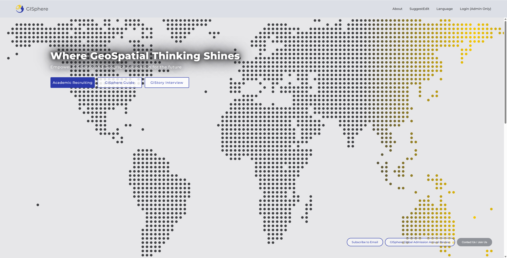
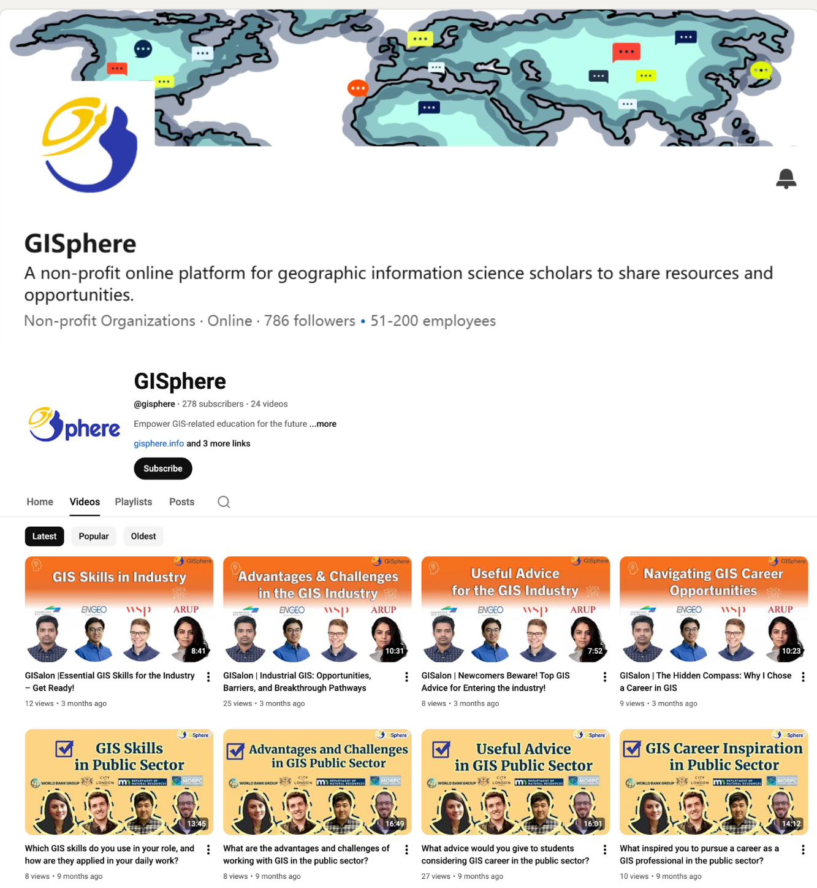

## Overview

GISphere is a non-profit initiative founded in 2019 by a group of graduate students and scholars in Geographic Information Science/System (GIS) and related fields. We aim to facilitate the freedom of information in GIS education, enhance academic exchange and collaboration, and contribute to both academia and industry.

**GISphere Guide** is our flagship database, it features comprehensive information on **480 GIS-related academic programs and over 1,400 professors** from more than **96 countries**. All the information is open-sourced on GitHub and available on the official website gisphere.info in English and Chinese. Beyond the GISphere Guide, we offer a range of resources to support students and professionals in the GIS community:

**GISalon**: Engaging roundtable discussions providing insights into study abroad experiences and career development. Recordings are available on YouTube (in English) and Bilibili (in Chinese).

*Our video recording of online roundtable on Bilibili.*

*Through our international presence on LinkedIn and YouTube, we connect Chinese talent with the global geospatial industry and academia.*

**GISource**: A global news service delivering up-to-date information on admissions for GIS-related master’s and doctoral programs and postdoctoral opportunities at international institutions, avilable on gisphere.info, and delivered bi-weekly via WeChat newsletter.

**GISphere WeChat Account**: Sharing application experiences and study insights from students in GIS-related programs abroad, along with GISource newsletter, GIStory articles, and more.

**GISpace**: Vibrant community discussion groups on WeChat and WhatsApp for interaction among overseas scholars and students in GIS-related fields.

**GIS Education Research**: We are committed to advancing GIS education through research. Our published work includes:

* Wang, Y., Kang, Y., Liu, H., Hou, C., Zhou, B., Ye, S., Liu, Y., Rao, J., Pei, Z., Ye, X., & Gao, S. (2023). Choosing GIS graduate programs from afar: Chinese students' perspectives. Transactions in GIS, 27, 450-475. https://foi.org/10.1111/tgis.13089
* Gu, Z., Li, W., Zhou, B., Wang, Y., Chen, Y., Ye, S., Wang, K., Gu, H. and Kang, Y. (2025), GISphere Knowledge Graph for Geography Education: Recommending Graduate Geographic Information System/Science Programs. Transactions in GIS, 29. https://doi.org/10.1111/tgis.13283
* More research papers coming soon.
Beginning as a Chinese platform, GISphere launched its English version website in April 2022, expanding our reach to a global audience.

We have been supported by over 150 volunteers and benefited more than 5,000 students and teachers. We are continuously enhancing our platform to provide timely information on graduate school opportunities, academic positions, and other relevant resources in GIS and related fields. We believe in the power of community and open access to knowledge to foster a stronger global GIS community and empower GIS education for the future. Stay tuned for more updates and developments!

---
### Links
Website: www.gisphere.info

Follow us on X (Twitter) for fresh academic opportunities like PhD scholarships and postdoc positions, and LinkedIn and subsribe our mailing list to stay updated on future events like GISalon webinars!

---

### Contact
This guide is frequently updated. We welcome you to join us in developing and maintaining this project. Please do not hesitate to contact us at gisphere@outlook.com or submit issues on GitHub if you wish to add or edit information on our website or contribute in other ways. We are also looking for volunteers - if you are interested, please send your CV and a short cover letter expressing your interest to us!

<!-- {}
Create your slides in Markdown - click the *Slides* button to check out the example.
{} -->

<!-- Add the publication's **full text** or **supplementary notes** here. You can use rich formatting such as including [code, math, and images](https://docs.hugoblox.com/content/writing-markdown-latex/). -->
