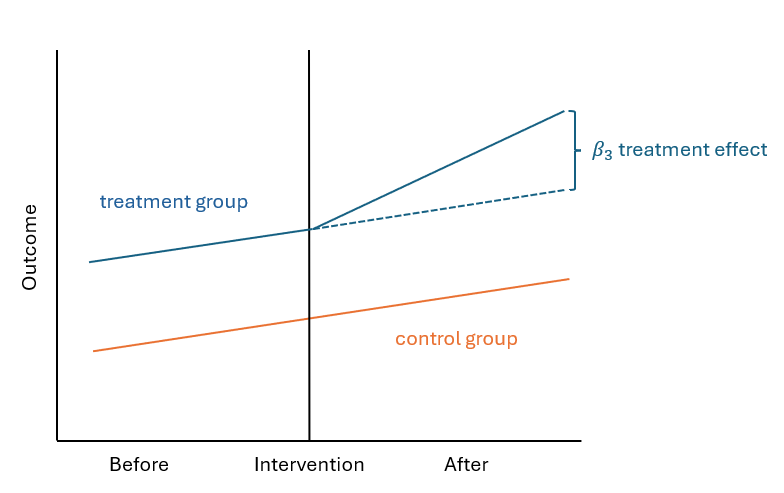

## 1 Overview 

Low Traffic Neighbourhoods (LTNs) are urban planning interventions aimed at reducing through traffic and improving road safety for pedestrians and cyclists. This study evaluates the effectiveness of LTNs in reducing traffic accidents in London using a Difference-in-Differences (DID) approach. The study analyzes annual traffic accident data from 2015 to mid 2024 and employs both a classic DID model and an improved DID model to assess the short- and long-term effects of LTNs.

**🛠 Skills & Tools:** <kbd>Python</kbd> <kbd>Causal Inference</kbd> <kbd>Econometrics (DID)</kbd> <kbd>Spatial Analysis</kbd> <kbd>Data Visualization</kbd>

*Note: This work is currently being prepared for publication.*

---

## 2 Methodology

To quantify the impact, I constructed two econometric models (DID) to compare accident trends between LTN areas (treatment) and non-LTN areas (control).

**Model A: Classic DID** Captures the immediate impact of policy implementation.
$$
Y_{it} = \beta_0 + \beta_1 \cdot treatment_i + \beta_2 \cdot post_t + \beta_3 \cdot (treatment_i \times post_t) + \varepsilon
$$

**Figure 2.** Conceptual illustration of the classic DID model.

**Model B: Improved DID** Addressed unobserved heterogeneity and time-varying effects (e.g., the COVID-19 pandemic). The time trend terms was introduced to validate the **Parallel Trends Assumption** and separate short-term shocks from long-term safety improvements.
$$
\begin{aligned}
Y_{it} &= \beta_0 + \beta_1 \cdot \text{treatment}_i + \beta_2 \cdot \text{post}_t + \beta_3 \cdot (\text{treatment}_i \times \text{post}_t) \ + \\
&\quad \beta_4 \cdot \text{timebefore}_t + \beta_5 \cdot \text{timeafter}_t + \beta_6 \cdot (\text{treatment}_i \times \text{timebefore}_t) \ + \\
&\quad \beta_7 \cdot (\text{treatment}_i \times \text{timeafter}_t) + \varepsilon_{it}
\end{aligned}
$$

**Figure 3.** Conceptual illustration of the improved DID model.

---

## 3 Key Findings & Visualization 

💡**Insight 1: Diverging Trends**  While accident rates were similar prior to 2020, LTN areas showed a sustained decline post-implementation, whereas city-wide accidents rebounded after the pandemic.

💡**Insight 2: Borough-Level Heterogeneity**  Most boroughs exhibited a reduction in crashes. Areas with increased crashes typically had low baseline accident counts, indicating high variance but low absolute impact.

💡**Insight 3: Quantifiable Safety Improvement**  
Results confirm the safety benefits of LTNs: 
**Immediate Effect**: Classic DID showed a 26.5% reduction in accident log-counts ($coef = -0.3072$). 
**Long-term Effect**: The Improved DID model indicated a sustained 10.0% reduction ($coef = -0.2404$), proving the policy's lasting value beyond the pandemic anomaly.

<!-- {}
Create your slides in Markdown - click the *Slides* button to check out the example.
{} -->

<!-- Add the publication's **full text** or **supplementary notes** here. You can use rich formatting such as including [code, math, and images](https://docs.hugoblox.com/content/writing-markdown-latex/). -->
