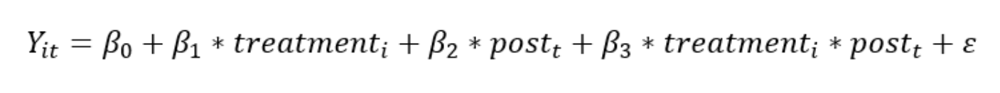
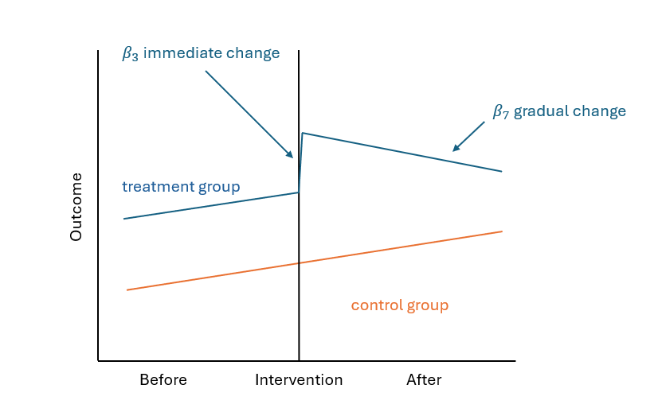

## Overview 

Low Traffic Neighbourhoods (LTNs) are urban planning interventions aimed at reducing through traffic and improving road safety for pedestrians and cyclists. This study evaluates the effectiveness of LTNs in reducing traffic accidents in London using a Difference-in-Differences (DID) approach. The study analyzes annual traffic accident data from 2015 to mid 2024 and employs both a traditional DID model and an improved DID model to assess the short- and long-term effects of LTNs. I am currently preparing for publication.

## Methodology

### Traditional Difference-in-Differences (DID) Analysis

Quantify the impact of LTNs on traffic accidents.

•	Yit: Logged annual accident count for the area in borough i in a given year t.

•	treatmenti: A binary variable indicating whether the area i in a borough is a LTN (1) or not (0).

•	postt: A binary variable indicating the period; the year t before the implementation of LTNs (before 2020) is 0, and the year t after the implementation of LTNs (after 2020) is 1.

•	treatmenti × postt: An interaction term indicating the effect of LTNs on treated boroughs after their implementation. This is the key coefficient of interest.

•	ε: Error term.

**Figure 2.** Conceptual illustration of the classic DID model.

### Improved   Difference-in-Differences (DID) Analysis

The Difference-in-Differences (DID) method is a widely used quasi-experimental technique for estimating causal relationships by comparing the differences in outcomes over time between a treatment group and a control group. The DID approach helps to eliminate biases that could arise from permanent differences between the groups and from time trends unrelated to the treatment. In this study, the DID method is employed to evaluate the impact of Low Traffic Neighbourhoods (LTNs) on the annual number of traffic accidents in London boroughs.

By using the traditional DID model, we have only captured the immediate effect of LTNs on accidents. There is also some unobserved heterogeneity and time-varying effects. To  account for unobserved heterogeneity, time-varying effects, and long-term effects of LTNs on road safety, an improved DID model was employed. 

The addition of time trend terms (timebefore_t and timeafter_t ) is to capture the overall trend in road safety over time before and after the implementation of the LTN policy, so that we can identify whether the LTNs have a better safety record. This helps to distinguish the effects of the LTN policy from general changes in the level of road safety in the city as a whole. 

To add the interactive items with the treatment group(treatment_i * timebefore_t and treatment_i * timeafter_t), which can quantify the impact of the LTN policy on road safety changes over time.

Model Specification:

•	timebeforet: Number of years since the start of the observation period.

•	timeaftert: Number of years since the start of the treatment.

•	treatmenti × timebeforet: Represents the difference in the trend in the number of accidents between the treatment and control groups before the introduction of LTNs. The effect of accident counts before the implementation of LTNs, allowing for the assessment of parallel trends assumption.

•	treatmenti × timeaftert: The gradual change of accident counts in LTN areas after the LTNs have been introduced.

In this model, we have removed the data from 2020 to 2021 as all eligible LTNs were introduced during this period and we were able to avoid the impact of the pandemic.

**Figure 3.** Conceptual illustration of the improved DID model.

## Results  

### Comparison of Traffic Accident inside and outside LTNs

**Figure 4.** Annual accident counts of inside and outside LTNs in the Greater London from 2015 to 2024.

Figure 4 presents the aggregate annual number of traffic cashes inside and outside the eligible LTNs. Before the implementation of eligible LTNs, both areas show similar trends. However, after the implementation of LTNs in 2020, the number of crashes in LTNs continues to decline, whereas the overall city accident counts increase post-pandemic. 

**Figure 5.** The absolute change and percentage trend compared between inside and outside LTNs in each borough before (2015-2019) and after (2020-2024) the implementation of LTNs.

Figure 5 further compares the annual average number of crashes inside and outside eligible LTNs within each borough, before and after the implantation. It shows the absolute and percentage change for London as a whole. The blue bars represent the change inside eligible LTNs, and the orange bars represent the change outside eligible LTNs. This figure highlights considerable variation between boroughs. Most LTNs show a reduction in the number of crashes and the boroughs with an increased change in LTNs tend to have a low number of crashes, for example, Enfield, have a low annual number of crashes on LTNs (1/3 of the average).

### Traditional DID Analysis on Traffic Accidents

**Table 1**. Basic DID model result.

•	Table 1 indicates the implementation of LTNs resulted in a 0.3072 reduction in the logged value of traffic accidents.

•	The traditional DID indicated the immediate reduction in accident counts after LTNs implementation.  

### Improved DID Analysis on Traffic Accidents

**Table 2.** Improved DID model result.

•	Table 2 shows that in the long term (after the introduction of LTN in 2020 and continuing until 2024), LTNs significantly reduced road accidents, with an estimated reduction of 0.2404 in the logged value of annual road accidents.

•	The parallel trend assumption is critical to the internal validity of a DID model. It assumes that in the absence of treatment, the difference between the treatment and control groups would remain constant over time. To determine whether the model satisfied the parallel trend assumption, the interaction term treatment_i * timebefore_t must not be significant. Table 2 shows that the interaction term treatment_i * timebefore_t is not significant, which means that the parallel trends assumption is met.

•	The improved model separated short-term and long-term effects, providing a deeper understanding of the impact of LTNs on road safety.

•	This sustained reduction highlights the sustainable contribution of LTNs to a safer urban environment.

## Data 

•	LTNs (update to August 2024): https://blog.westminster.ac.uk/ata/projects/london-ltn-dataset/

https://www.healthystreetsscorecard.london/ltn-low-traffic-neighbourhood-schemes-mapping/

•	London borough: https://data.london.gov.uk/dataset/london_boroughs

•	STAT19 (Road Safety Data): py-stats19 - https://pypi.org/project/pystats19/

<!-- {}
Create your slides in Markdown - click the *Slides* button to check out the example.
{} -->

<!-- Add the publication's **full text** or **supplementary notes** here. You can use rich formatting such as including [code, math, and images](https://docs.hugoblox.com/content/writing-markdown-latex/). -->
