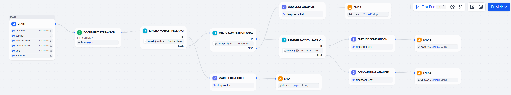

## Streamlining Amazon Workflows with Dify & LLM Integration

**🛠 Skills & Tools:** <kbd>Dify</kbd> <kbd>LLM Engineering</kbd> <kbd>Prompt Engineering</kbd> <kbd>Workflow Automation</kbd> <kbd>E-commerce Operations</kbd>

---
## **Scaling Operations in a Complex Market**
**Client:** Anker Innovations (Top 1 Global Mobile Charging Brand)

Expanding globally on platforms like Amazon requires relentless market research and precise, localised copywriting. However, the client's internal teams were experiencing difficulties.

1. Manual competitor analysis and SEO keyword extraction took a lot of time, so campaign launches were slow.
2. Multiple staff members produced outputs of different quality and tone.
3. Staff were frustrated by the complexity of the process and its lack of transparency. 
My goal is to engineer an intelligent automation pipeline that can 'think' like a senior analyst, automatically categorising tasks and generating highly accurate reports without human intervention.

---

## The Solution: A Logic-Driven AI Workflow

I used Dify, an open-source LLM platform, to design a modular AI workflow. Rather than creating a simple chatbot, I developed a decision-making agent. The system follows a strict logic path.

**The Workflow**

*Figure 1: The AI Agent workflow is designed on Dify. It demonstrates logical branching (IF/ELSE nodes), which enables the system to perform multiple distinct tasks, from market research to feature comparison, within a single interface.*

---
Using DeepSeek models, I tuned the prompts for each node to ensure that the AI understood the nuances of Amazon's SEO algorithms. Standardising the input-output flow eliminated human error in data entry and formatting. The transparent design of the module allows staff to see exactly how the AI reaches its conclusions, reducing frustration and building trust in the tool.

---

## Impact & Results
The team's operational rhythm was transformed by the implementation of this AI workflow:

1. 4× Efficiency Boost: Staff can now complete comprehensive market reports in a shorter time.
2. 20% Higher Accuracy: The AI-driven SEO campaigns showed a measurable improvement in keyword targeting and ranking.
3. Scalability: The workflow is modular, meaning new tasks can be added simply by connecting a new node, future-proofing the client's operations.

<!-- {}
Create your slides in Markdown - click the *Slides* button to check out the example.
{} -->

<!-- Add the publication's **full text** or **supplementary notes** here. You can use rich formatting such as including [code, math, and images](https://docs.hugoblox.com/content/writing-markdown-latex/). -->
