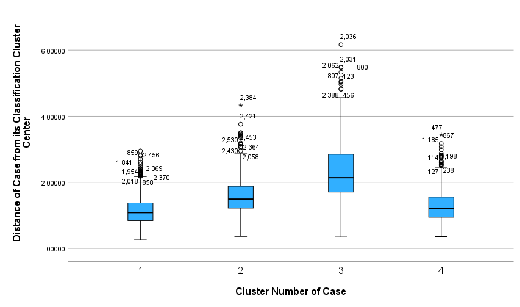
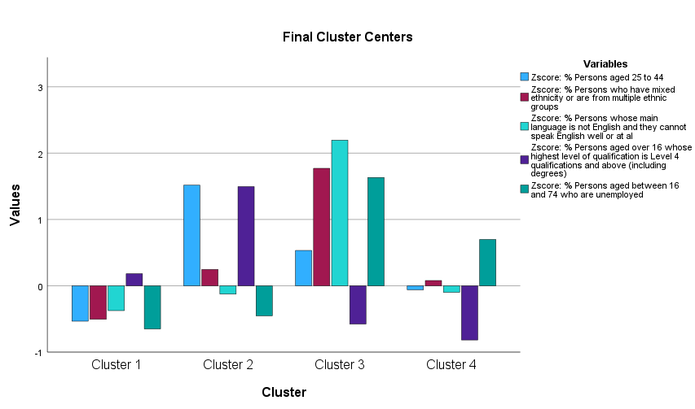
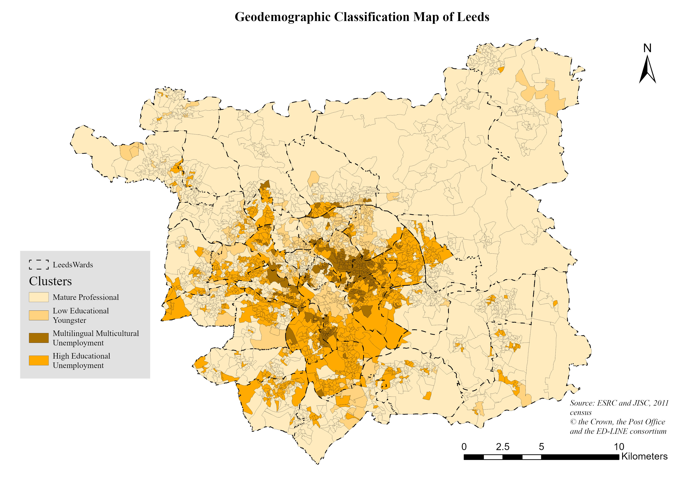

This project aimed to solve a real-world problem for the Leeds-based charity, Learning Partnerships. They needed to pinpoint neighbourhoods with the highest concentration of young, disadvantaged adults to effectively deploy a new support initiative. My goal was to transform raw census data into an actionable, location-based strategy for them. 

My approach involved creating a bespoke geodemographic classification. I began by strategically selecting key census variables that act as proxies for disadvantage, such as unemployment and low educational attainment. Using SPSS, I applied the K-means clustering algorithm to segment all of Leeds' neighbourhoods into four statistically distinct groups. The final step was to join this classification data to a map in ArcGIS Pro, allowing for a clear geographic visualization of the results.

The analysis successfully identified a key target group, which I named the "Multilingual Multicultural Unemployment" cluster. As the final map revealed, these neighbourhoods are heavily concentrated in inner-city Leeds and are characterized by extremely high unemployment and significant language barriers. This output provides Learning Partnerships with an evidence-based strategy to focus their resources, tailor their services, and ultimately maximize their social impact by reaching the communities that need them most.

<!-- {}
Create your slides in Markdown - click the *Slides* button to check out the example.
{} -->

<!-- Add the publication's **full text** or **supplementary notes** here. You can use rich formatting such as including [code, math, and images](https://docs.hugoblox.com/content/writing-markdown-latex/). -->
