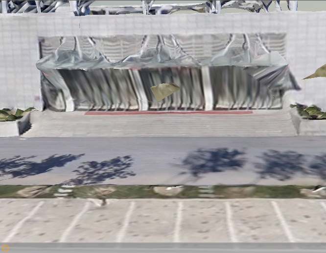
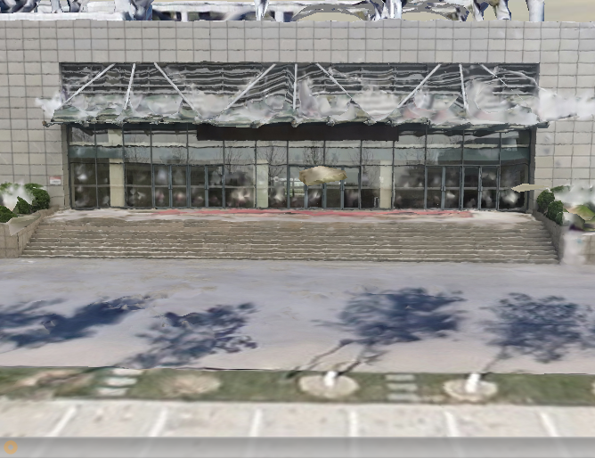

**🛠 Skills & Tools:** <kbd>ContextCapture</kbd> <kbd>Photogrammetry</kbd> <kbd>UAV/Drone Surveying</kbd> <kbd>3D Modelling</kbd> <kbd>Data Fusion</kbd>

---

## The Ground-Level Gap

In the field of 3D urban modelling, drones are exceptional at capturing roof structures and large-scale topography. However, they have one major limitation: the 'blind angle'. 

Models generated solely from aerial data often exhibit significant distortion at street level. Facades appear distorted and intricate details such as walkways and entrances lack texture clarity. My goal was to bridge this gap by developing a cost-effective workflow that fuses aerial imagery with high-resolution ground-based smartphone data to create a true digital twin.

My goal was to produce a single, high-fidelity 3D model with crisp ground-level details, without relying on expensive, specialised LiDAR equipment.

---

## Methodology: Multi-Source Data Fusion

My methodology focused on combining two different datasets — the "macro" view from the drone and the "micro" view from the smartphone — into a single coordinate system.

1.  **Data acquisition**: I captured an overview of the library using a drone, whilst simultaneously capturing ground-level details (façades, stairs and pillars) using a standard smartphone camera.
2.  **Local reconstruction**: I first processed the smartphone images to create a highly detailed local model.
3.  **Coordinate unification**: This was the crucial technical step. I used common tie points to perform absolute orientation and similarity transformation. This precisely aligned the large-scale aerial model with the detailed ground coordinates.
4.  **Integrated fusion**: Finally, I merged the aligned datasets in ContextCapture, creating a seamless mesh that retained the best features of both sources.

---

## Results: Visual Comparison

The difference in quality is immediately apparent. The picture below illustrates the difference in geometry and texture quality between the traditional UAV-only approach and my fused workflow.

| **Before: UAV Data Only** | **After: Multi-Source Fusion** |
| :---: | :---: |
|  |  |
| *Note the distorted geometry at the entrance and the blurry textures on the ground.* | *Clear textures and accurate geometry for complex features like stairs and pillars.* |

---

## Impact & Conclusion

The project successfully demonstrated that high-fidelity 3D modelling does not require a prohibitively large budget.

* **Holistic accuracy**: the fused model exhibits complete geometry for complex ground-level features that were previously distorted. 
* **Scalable workflow**: By demonstrating that smartphone data can be successfully integrated with aerial surveys, the project provides a practical solution for urban planning and architectural visualisation.
* **Cost-effectiveness**: It significantly reduces the barrier to creating realistic digital twins, bypassing the need for expensive ground-based laser scanners.

<!-- {}
Create your slides in Markdown - click the *Slides* button to check out the example.
{} -->

<!-- Add the publication's **full text** or **supplementary notes** here. You can use rich formatting such as including [code, math, and images](https://docs.hugoblox.com/content/writing-markdown-latex/). -->
